https://www.acwing.com/activity/content/22/

# Hot 100

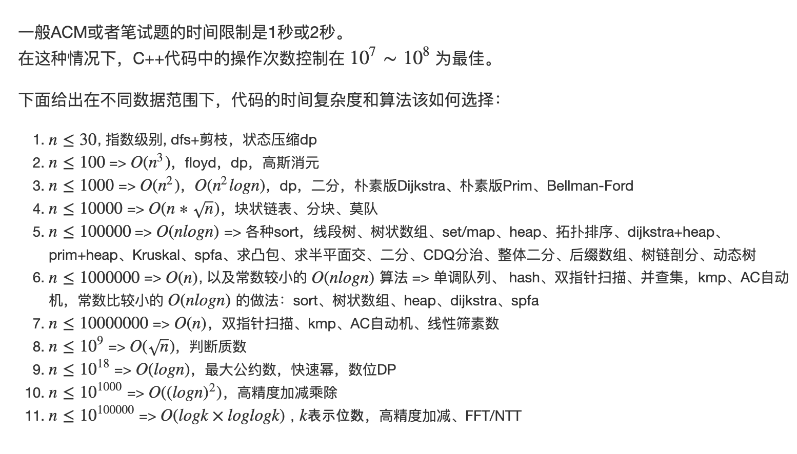

## [ 1. 两数之和](https://leetcode.cn/problems/two-sum/)✅

**题目分析 ** https://www.acwing.com/activity/content/problem/content/2326/

在数组中寻找满足条件的两个数，暴力做法两重循环，$O(n^2)$ ；考虑优化，实际上第二层循环就是做一件事：看数组中是否存在target - a[i]。判断是否存在就可以用哈希表，存储数组中已经遍历过的元素.  $O(n)$

```c++
class Solution {
public:
    vector<int> twoSum(vector<int>& nums, int target) {
        unordered_map<int, int> hash;
        // 遍历以i作为第二个元素的所有情况    
        for (int i = 0; i < nums.size(); ++i) {
            int t = target - nums[i];
            // 此时i之前的所有元素都已经加到表中，直接查表 （*）
            if (hash.count(t)) return {hash[t], i};
            // 将i加入表中，只有这样（*）才恒成立
            hash[nums[i]] = i;
        }
        return {};
    }
};
```

## [2. 两数相加](https://leetcode.cn/problems/add-two-numbers/)✅

**题目分析**  https://www.acwing.com/activity/content/problem/content/2327/

模板题，高精度加法。模拟竖式运算即可，$O(n)$

```c++
class Solution {
public:
    ListNode* addTwoNumbers(ListNode* l1, ListNode* l2) {
        // 链表题常用写法，当你需要一条新链表作为返回时
        auto dummy = new ListNode(-1), tail = dummy;
        int t = 0;
        // 同时遍历两个链表，退出条件是两条链表都已经走完且进位也计算完毕
        while (l1 || l2 || t) {
            if (l1) t += l1->val, l1 = l1->next;
            if (l2) t += l2->val, l2 = l2->next;
            tail->next = new ListNode(t % 10);
            tail = tail->next; // 细节，三个迭代的语句不能丢
            t /= 10;
        }
        return dummy->next;
    }
};
```

**bug history**

```c++
ListNode* addTwoNumbers(ListNode* l1, ListNode* l2) {
        ListNode *dummy = new ListNode(-1);
        ListNode *pres = dummy->next; // 此时pres只是空指针而已，和dummy没关系
        int t = 0;
        while (l1 || l2 || t) {
            if (l1) t += l1->val, l1 = l1->next;
            if (l2) t += l2->val, l2 = l2->next;
            pres = new ListNode(t % 10); pres = pres->next;
            t /= 10;
        }
        return dummy->next;
    }
```

对链表的理解不够，这样初始化 pres，整个链表根本连不上，每次第8行赋值语句都是一个新的孤立的节点！！

## [3. 无重复字符的最长子串](https://leetcode.cn/problems/longest-substring-without-repeating-characters/)✅

**题目分析**  https://www.acwing.com/activity/content/problem/content/2328/

遍历所有子串，判断是否重复然后更新最长长度，需要n^2的复杂度。如何优化？

s = "abcabcbb"

很明显可以用双指针的做法，从O(n^2)优化到O(n)。[i, j]维护以j为终点最长的不重复子串，它有什么样的单调性质？每次j向右移动的时候，如果i可以向左移动，那么[i - 1, j]是一段更长的以j为终点的不重复子串，矛盾。因此j向右移动，i只能不动或向右。

```c++
class Solution {
public:
    int lengthOfLongestSubstring(string s) {
        int maxlen = 0;
        unordered_map<char, int> hash;
        for (int i = 0, j = 0; j < s.size(); ++j) {
            // 以j为右端点的子串的所有情况
            // 此时的i已经是j-1对应的最左端点，本轮更新了j，还没有更新i
            // 如果[i, j]出现了重复，则更新i使重复消失

            // 我们维护了一个记录[i,j-1]中字符出现情况的哈希表，此时把j也放进去
            hash[s[j]]++;
            while (hash[s[j]] > 1) { // 出现重复 -> 更新i
                hash[s[i++]]--;
            }

            // 此时的[i, j]无重复
            maxlen = max(maxlen, j - i + 1);
        }
        return maxlen;
    }
};
```


## [4. 寻找两个正序数组的中位数](https://leetcode.cn/problems/median-of-two-sorted-arrays/)✅

**题目分析**  https://www.acwing.com/activity/content/problem/content/2329/

归并之后长度m+n，若m+n为奇数，中位数=第(m+n)/2+1个数；若m+n为偶数，中位数=avg 第(m+n)/2个数和第(m+n)/2+1个数。复杂度为nlogn。可以看出，求中位数实际上可以通过求在两个数组的所有数中排名第k的数来计算。其实就是在“第k个数”的基础上改成两个数组的版本。

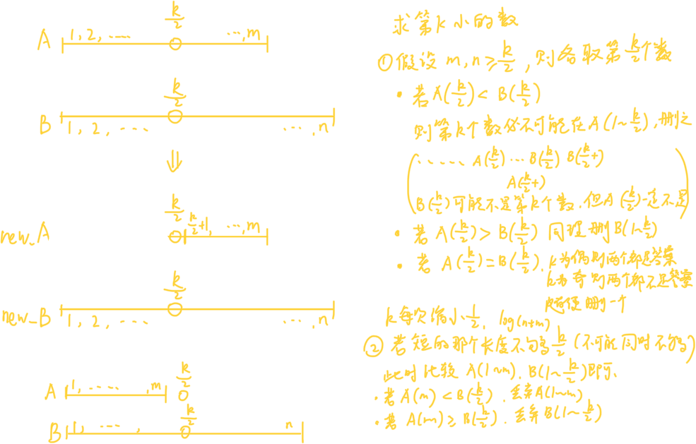

```c++
class Solution {
public:
    double findMedianSortedArrays(vector<int>& nums1, vector<int>& nums2) {
        int tot = nums1.size() + nums2.size();
        if (tot % 2) return findKth(nums1, 0, nums2, 0, tot / 2 + 1);
        return (findKth(nums1, 0, nums2, 0, tot / 2) + findKth(nums1, 0, nums2, 0, tot / 2 + 1)) / 2.0; //int to double
    }

    int findKth(vector<int>& nums1, int i, vector<int>& nums2, int j, int k) {
        // ^ 因为我们每次要删k/2个元素，不可能真的从数组里抠出来，而是用一个下标i/j维护没被删的起始位置

        // 短的放前面，避免分类讨论
        if (nums1.size() - i > nums2.size() - j) return findKth(nums2, j, nums1, i, k);

        // if empty, only short can be empty
        if (nums1.size() == i) return nums2[j + k - 1]; // 直接选2中第k个

        // base 因为k每次/=2，必然会递归到这个条件
        if (k == 1) return min(nums1[i], nums2[j]);

        int si = min(int(nums1.size()), i + k / 2), sj = j + k / 2; // 这里是图中圆圈的下一位置
        if (nums1[si - 1] < nums2[sj - 1]) return findKth(nums1, si, nums2, j, k - si + i);
        else return findKth(nums1, i, nums2, sj, k - sj + j);
    }
};
```

## [5. 最长回文子串](https://leetcode.cn/problems/longest-palindromic-substring/)✅

**题目分析**  https://www.acwing.com/activity/content/problem/content/2330/

双指针，遍历回文的中心，分奇偶讨论 O(n^2)

```c++
class Solution {
public:
    string longestPalindrome(string s) {
        // odd
        string res;
        for (int i = 0; i < s.size(); ++i) {
            int l = i, r = i;
            while (l >= 0&& r < s.size() && s[l] == s[r]) l--, r++; // 注意这里是大于等于
            // 此时[l+1, r-1]为以i为中心的最长回文子串
            if (r - l - 1 > res.size()) res = s.substr(l + 1, r - l - 1);
        }

        // even
        for (int i = 0; i < s.size() - 1; ++i) {
            int l = i, r = i + 1;
            while (l >= 0 && r < s.size() && s[l] == s[r]) l--, r++;
            if (r - l - 1 > res.size()) res = s.substr(l + 1, r - l - 1);
        }

        return res;
    }
};
```

## [10. 正则表达式匹配](https://leetcode.cn/problems/regular-expression-matching/)✅

https://www.acwing.com/activity/content/problem/content/2335/

用什么算法？dp，经验：很多两个字符串的题都是dp，例如最长公共子序列。

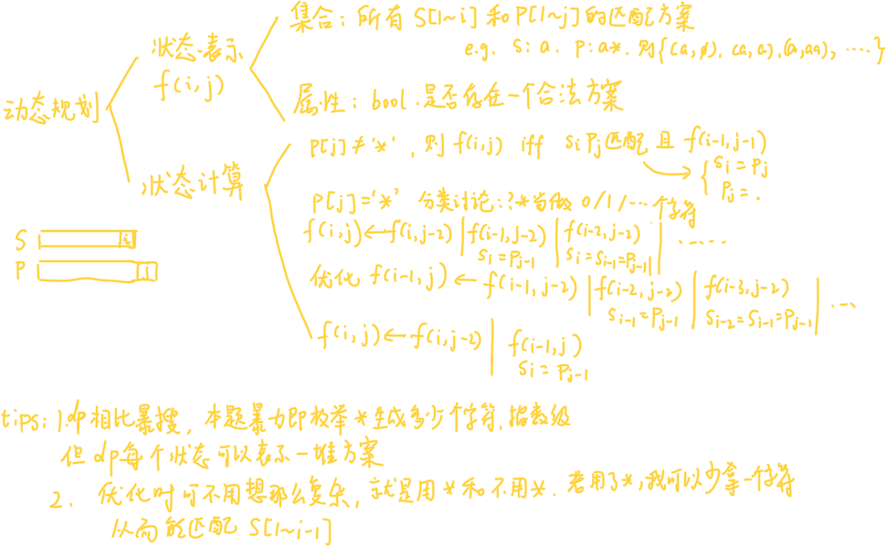

n*m个状态，状态转移O(1)，总复杂度O(mn)

```c++
class Solution {
public:
    bool isMatch(string s, string p) {
        vector<vector<bool>> f(23, vector<bool>(33)); // dp数组
        int n = s.size(), m = p.size();
        s = ' ' + s, p = ' ' + p; // 下标从1开始
        f[0][0] = true;
        for (int i = 0; i <= n; ++i) {
            for (int j = 1; j <= m; ++j) { 
                // ^ s为空p不为空不可能匹配，所以j从1开始
                if (j + 1 <= m && p[j + 1] == '*') continue; // 要把*和前一个字符看成一个整体
                if (p[j] != '*') {
                    if (i) f[i][j] = f[i - 1][j - 1] && (s[i] == p[j] || p[j] == '.');
                    // ^ i可能从0开始，此时必不匹配。只有当i大于0才有可能匹配。
                } else {
                    f[i][j] = j > 1 && f[i][j - 2] || i && f[i - 1][j] && (s[i] == p[j - 1] || p[j- 1] == '.');
                    //         ^                      ^ 保证下标不越界
                }
            }
        }
        return f[n][m];
    }
};
```

## [11. 盛最多水的容器](https://leetcode.cn/problems/container-with-most-water/)✅

https://www.acwing.com/activity/content/problem/content/2344/

贪心/双指针 O(n)


用两个指针i,j，维护矩形的左边界和右边界。由于矩形面积=(j-i)*两高度的较小值，一开始贪心的把指针放在最左和最右。由于矩形面积取决于较小的边，**如果移动高边**，矩形宽必变小，而高≤原来的高，面积必然变小。因此，假设i更高，则(i, j)已经包含了所有以j为右边界的情况；反之亦然。

因此**每次移动矮边**，更新最大面积，直到j≤i，此时所有情况都已经被遍历。

```c++
class Solution {
public:
    int maxArea(vector<int>& height) {
        int res = 0;
        for (int i = 0, j = height.size() - 1; i < j;) {
            res = max(res, min(height[i], height[j]) * (j - i));
            if (height[i] > height[j]) j -- ;
            else i ++ ;
        }
        return res;
    }
};
```


## [15. 三数之和](https://leetcode.cn/problems/3sum/)✅

https://www.acwing.com/activity/content/problem/content/2348/

双指针 O(n^2)

```c++
class Solution {
public:
    vector<vector<int>> threeSum(vector<int>& nums) {
        vector<vector<int>> res;  // save answer
        sort(nums.begin(), nums.end());  // index is irrelevant to question, so just sort it
        for (int i = 0; i < nums.size(); ++i) {
            if (i/*corner*/ && nums[i - 1] == nums[i]) continue; // deduplicate e.g. [1,1,1,1,-2]
            if (nums[i] > 0) break;
            for (int j = i + 1, k = nums.size() - 1; j < k; /*iter*/j++) {
                if (j > i + 1/*corner*/ && nums[j] == nums[j - 1]) continue; // deduplicate
                while (j < k - 1/*make sure j<k*/ && nums[i] + nums[j] + nums[k - 1] >= 0) k--;
                if (nums[i] + nums[j] + nums[k] == 0) {
                    res.push_back({nums[i], nums[j], nums[k]});
                }
            }
        }
        return res;
    }
};
```


## [17. 电话号码的字母组合](https://leetcode.cn/problems/letter-combinations-of-a-phone-number/)✅

https://www.acwing.com/activity/content/problem/content/2350/

暴搜，dfs。递归搜索树。模板题

```c++
class Solution {
public:
    vector<string> lu{"", "", "abc", "def", "ghi", "jkl", "mno", "pqrs", "tuv", "wxyz"}; //c++11 vector init
    vector<string> ans;
    string path;
    vector<string> letterCombinations(string digits) {
        // depth-first search
        if (digits.empty()) return {};
        dfs(digits, 0);
        return ans;
    }

    void dfs(string& digits, int u) { // layer u, go to layer u + 1
        if (u == digits.size()) {
            ans.push_back(path);
            return;
        }
        for (auto c: lu[digits[u] - '0']) {
            path += c;
            dfs(digits, u+1);
            path.pop_back(); // bp
        }
    }
};
```

## [19. 删除链表的倒数第 N 个结点](https://leetcode.cn/problems/remove-nth-node-from-end-of-list/)✅

https://www.acwing.com/activity/content/problem/content/2352/

核心：找倒数第N个点的前一个点，让这个点的next指针=倒数第N个点的next指针。可能删头节点，所以引入dummy。O(n)

双指针来做，一个指针走到头，另一个指针刚好指到我们要找的位置。易错的地方在于，双指针之间刚开始间隔几个节点？对着样例来模拟即可。


```
输入：head = [1,2,3,4,5], n = 2
输出：[1,2,3,5]
```

```c++
class Solution {
public:
    ListNode* removeNthFromEnd(ListNode* head, int n) {
        auto dummy = new ListNode(-1);
        dummy->next = head;
        auto p = dummy, q = head;
        while (n--) q = q->next; // 初始[0, n+1] -> [len-n-1 ,len] len-1是倒数第一个，所以len-n-1是倒数第n+1个
        while (q) {
            p = p->next;
            q = q->next;
        }
        p->next = p->next->next;
        return dummy->next;
    }
};
```

## [20. 有效的括号](https://leetcode.cn/problems/valid-parentheses/)✅

https://www.acwing.com/activity/content/problem/content/2353/

考察栈，ez题

```c++
// 普通人写法
class Solution {
public:
    bool isValid(string s) {
        stack<char> stk;
        for (auto c: s) {
            if (c == '(' || c == '[' || c == '{') stk.push(c);
            else {
                if (c == ')') {
                    if (stk.size() && stk.top() == '(') stk.pop();
                    else return false;
                } else if (c == ']') {
                    if (stk.size() && stk.top() == '[') stk.pop();
                    else return false;
                } else {
                    if (stk.size() && stk.top() == '{') stk.pop();
                    else return false;
                }
            }
        }
        return stk.empty();
    }
};

// 大神写法
class Solution {
public:
    bool isValid(string s) {
        stack<char> stk;

        for (auto c : s) {
            if (c == '(' || c == '[' || c == '{') stk.push(c);
            else {
                if (stk.size() && abs(stk.top() - c) <= 2) stk.pop();
                else return false;
            }
        }

        return stk.empty();
    }
};
```


## [21. 合并两个有序链表](https://leetcode.cn/problems/merge-two-sorted-lists/)✅

https://www.acwing.com/activity/content/problem/content/2354/

模板：二路归并。注意不要忘了每次迭代更新所有指针!!!

```c++
class Solution {
public:
    ListNode* mergeTwoLists(ListNode* l1, ListNode* l2) {
        auto dummy = new ListNode(-1), tail = dummy;

        while (l1 && l2) {
            if (l1->val < l2->val) {
                tail->next = l1;
                l1 = l1->next; // note
            } else {
                tail->next = l2;
                l2 = l2->next; // note
            }
            tail = tail->next; // note
        }
        if (l1) tail->next = l1;
        else tail->next = l2;

        return dummy->next;
    }
};
```

## [22. 括号生成](https://leetcode.cn/problems/generate-parentheses/)✅

https://www.acwing.com/activity/content/problem/content/2355/

dfs题。判断括号序列有效有两种方法：一个是用stack，遇到左括号入栈，遇到右括号判断并出栈；另一个就是任意前缀中，左括号数量大于右括号数量。这两种方法原理都是一样的。

时间复杂度：卡特兰数$O(C_{2n}^{n})$。理解记忆：大致数量级是2n个位置选n个

```c++
 				/*
        - 一个括号序列有效的条件
        1. 任意前缀中，左括号数量大于右括号数量
        2. 左右括号数量相等

        [(, ), ...]
        - 什么时候能填左括号: l_cnt < n
        - 什么时候能填右括号: r_cnt < n && l_cnt > r_cnt
        */
class Solution {
public:
    vector<string> res;
    string path;
    vector<string> generateParenthesis(int n) {
        dfs(0, 0, 0, n);
        return res;
    }
    void dfs(int u, int ln, int rn, int n) {
        if (ln == n && rn == n) {
            res.push_back(path);
            return;
        }
        string cur;
        if (ln < n) cur += '(';
        if (rn < n && ln > rn) cur += ')';
        for (auto c: cur) {
            if (c == '(') {
                path += '(';
                dfs(u + 1, ln + 1, rn, n);
            } else {
                path += ')';
                dfs(u + 1, ln, rn + 1, n);
            }
            path.pop_back();
        }
    }
};
```

## [23. 合并K个升序链表](https://leetcode.cn/problems/merge-k-sorted-lists/)✅

**priority_queue<T, vector\<T\>, Compare> **

常数时间内找到最大值（默认），对数时间内插入和删除。可以自定义Compare，例如`std::greater<T>`可以将最小值放在top

重写Compare：通过重载( )运算符实现

```c++
class Solution {
public:

    struct Cmp {
        bool operator() (ListNode* a, ListNode* b) {
            return a->val > b->val; // pq's root is biggest, so reverse here
        }
    };

    ListNode* mergeKLists(vector<ListNode*>& lists) {
        /*
            every time merge the smallest of lists
                                    ^ ---> heap
        */

        priority_queue<ListNode*, vector<ListNode*>, Cmp> heap;
        auto dummy = new ListNode(-1), tail = dummy;
        for (auto l: lists) {
            if (l) heap.push(l);
        }

        // merge
        while (heap.size()) {
            auto t = heap.top();
            heap.pop();
            tail = tail->next = t;
            if (t->next) heap.push(t->next);
        }

        return dummy->next;
    }
};
```

## [31. 下一个排列](https://leetcode.cn/problems/next-permutation/)✅

https://www.acwing.com/activity/content/problem/content/2368/

首先要理解每一步做了什么，其次注意细节的实现。corner case：元素重复。

```c++
class Solution {
public:
    void nextPermutation(vector<int>& nums) {
        /*
            本题考查对字典序的理解
                        5                       5
                    4                                   4
                            3    -->                3
                2                           2
            1                           1
        */

       // 从右往左找到第一个*严格*降序对
        int k = nums.size() - 1; //[k-1,k]
        while (k && nums[k - 1] >= nums[k]) k--;
        // [k-1 < k] 

        // 特判：没有降序对
        if (!k) sort(nums.begin(), nums.end());
        else {
            // 让降序对的左元素增大 <-- 从右边所有数中找到最小的比左元素大的，交换，然后对左元素右边所有数排序
            int j = k;
            while (j < nums.size() && nums[j] > nums[k - 1]) j++;
            swap(nums[k - 1], nums[j - 1]);
            sort(nums.begin() + k, nums.end());
        }
    }
};
```

## [32. 最长有效括号](https://leetcode.cn/problems/longest-valid-parentheses/)✅

https://www.acwing.com/activity/content/problem/content/2369/

第22题已经总结过，括号序列有效的条件
1. 任意前缀中，左括号数量大于右括号数量
2. 左右括号数量相等

做题不仅要知道解法，还要知道这样解题为什么是对的。然后构造好样例，对着样例写。只需扫描一遍，复杂度O(n)

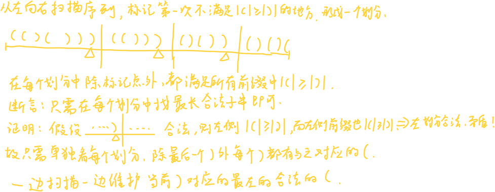

```c++
class Solution {
public:
    int longestValidParentheses(string s) {
        stack<int> stk;
        int res = 0;
        // 从左往右扫描
        for (int i = 0, start = 0/*表示当前划分的起点*/; i < s.size(); ++i) {
            if (s[i] == '(') {
                stk.push(i);
            } else {
                if (stk.size()) { // 说明当前右括号还是合法子串的一部分
                    stk.pop();
                    if (stk.size()) { // 之前有左括号多出来
                        res = max(res, i - stk.top());
                    } else { // [start, i]都合法
                        res = max(res, i - start + 1);
                    }
                } else { // 此时的i是不合法划分
                    start = i + 1;
                }
            }
        }
        return res;
    }
};
```

## [33. 搜索旋转排序数组](https://leetcode.cn/problems/search-in-rotated-sorted-array/)✅

https://www.acwing.com/activity/content/problem/content/2370/

熟练掌握二分模板，注意两种情况的区别。对于边界情况一定要想清楚。

```c++
class Solution {
public:
    int search(vector<int>& nums, int target) {
        // 特判
        if (nums.empty()) return -1;

        // 二分出分界点
        int l = 0, r = nums.size() - 1;
        while (l < r) {
            int mid = l + r + 1>> 1;
            if (nums[mid] >= nums[0]) l = mid;
            else r = mid - 1;
        }

        // [0, l/r], [l+1, size-1]
        if (target >= nums[0]) l = 0;
        else l = r + 1, r = nums.size() - 1;

        if (l > r) return -1; // 某一侧为空的情况，如果不加这个特判，后面算结果时不能用l，因为l可能越界。

        while (l < r) {
            int mid = l + r >> 1;
            if (nums[mid] >= target) r = mid;
            else l = mid + 1;
        }
        if (nums[l] == target) return l;
        else return -1;
    }
};
```

## [34. 在排序数组中查找元素的第一个和最后一个位置](https://leetcode.cn/problems/find-first-and-last-position-of-element-in-sorted-array/)✅

```c++
class Solution {
public:
    vector<int> searchRange(vector<int>& nums, int target) {
        vector<int> res;
        if (nums.empty()) return {-1, -1};
        int l = 0, r = nums.size() - 1;
        while (l < r) { // 1 2 2 2 3
            int mid = l + r >> 1;
            if (nums[mid] >= target) r = mid;
            else l = mid + 1;
        }
        if (nums[l] != target) return {-1, -1};
        res.push_back(l);
        r = nums.size() - 1;
        while (l < r) {
            int mid = l + r + 1 >> 1;
            if (nums[mid] <= target) l = mid;
            else r = mid - 1;
        }
        res.push_back(l);
        return res;
    }
};
```

## [39. 组合总和](https://leetcode.cn/problems/combination-sum/)✅

https://www.acwing.com/activity/content/problem/content/2376/

因为要返回所有方案，所以完全背包没有用（完全背包只能计算所有方案数）。直接暴搜就可以了，核心是考虑搜索顺序：如何搜才能不重不漏。

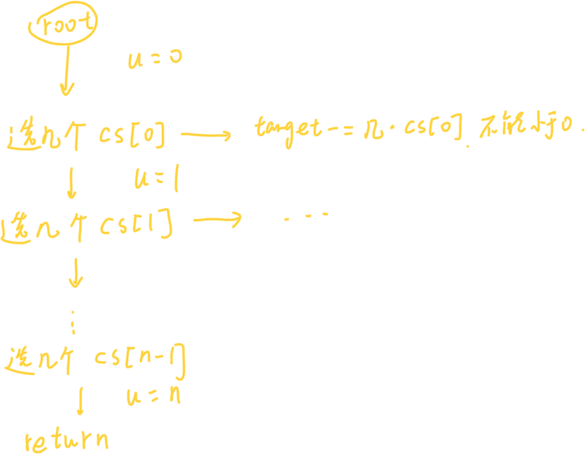

```c++
class Solution {
public:
    vector<vector<int>> res;
    vector<int> path;
    vector<vector<int>> combinationSum(vector<int>& candidates, int target) {
        dfs(0, target, candidates);
        return res;
    }

    void dfs(int u, int target, vector<int>& candidates) {
        if (target == 0) {
            res.push_back(path);
            return; // 这里为什么要return？
            // 因为如果不加return，还会继续往深处搜，而更深的每一个节点都有target==0，会重复添加n - u个相同的path。
        }
        if (u == candidates.size()) return;

        int cur = candidates[u];
        for (int i = 0; i * cur <= target; ++i) {
            for (int j = 0; j < i; ++j) path.push_back(cur);
            dfs(u + 1, target - i * cur, candidates);            
            for (int j = 0; j < i; ++j) path.pop_back();
        }
    }
};
```


## [42. 接雨水](https://leetcode.cn/problems/trapping-rain-water/)✅

https://www.acwing.com/video/1374/

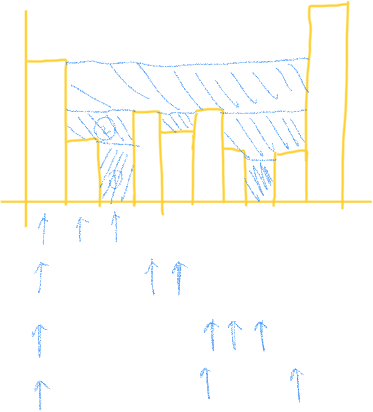

单调栈。栈里所有元素从bot到top递减，这样当下一个元素比栈顶高时，就可以接新的雨水。做的时候模拟一遍。因为扫描一遍，所以时间复杂度为O(n)，空间复杂度为O(n).

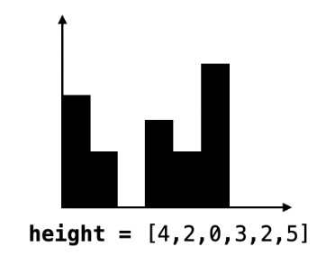

```c++
class Solution {
public:
    int trap(vector<int>& height) {
        int n = height.size();
        stack<int> stk;
        int res = 0;

        // 从左往右扫描
        for (int i = 0; i < n; ++i) {
          	// 内循环，处理需要更新res的逻辑
            while (stk.size() && height[i] > height[stk.top()]) {
                // 每次循环的目的是卡当前积水的四个边界
                // i为右边界
                auto cur = stk.top(); // 下边界
                stk.pop();
                // 如果栈中没有元素了，说明没有左边界，无法积水
                if (stk.empty()) break;
                auto last = stk.top(); // 左边界
                res += (min(height[i], height[last]) - height[cur]) * (i - last - 1); // 通过左边界和右边界算出上边界
            }
            // 每个元素都会入栈一次，内循环决定出栈
            stk.push(i);
        }
        return res;
    }
};
```

## [46. 全排列](https://leetcode.cn/problems/permutations/)✅

https://www.acwing.com/activity/content/problem/content/2383/

dfs。trivial。

```c++
class Solution {
public:
    vector<vector<int>> res;
    vector<int> path;
    bool used[10];
    vector<vector<int>> permute(vector<int>& nums) {
        dfs(0, nums);
        return res;
    }

    void dfs(int u, vector<int>& nums) {
        if (u == nums.size()) { 
            res.push_back(path);
            return;
        }

        for (int i = 0; i < nums.size(); ++i) {
            if (!used[i]) {
                used[i] = true;
                path.push_back(nums[i]);
                dfs(u + 1, nums);
                path.pop_back();
                used[i] = false;
            }
        }
    }
};
```


## [48. 旋转图像](https://leetcode.cn/problems/rotate-image/)✅ 

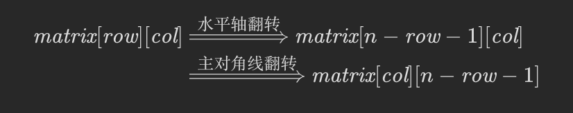

```c++
class Solution {
public:
    void rotate(vector<vector<int>>& matrix) {
        int n = matrix.size();
        for (int i = 0; i < n; ++i) {
            for (int j = i + 1; j < n; ++j) {
                swap(matrix[i][j], matrix[j][i]);
            }
        }

        for (int i = 0; i < n; ++i) {
            for (int j = 0; j < n / 2; ++j) {
                swap(matrix[i][j], matrix[i][n - 1 - j]);
            }
        }
    }
};
```


## [49. 字母异位词分组](https://leetcode.cn/problems/group-anagrams/)✅ 

https://www.acwing.com/activity/content/code/content/356303/

```c++
class Solution {
public:
    vector<vector<string>> res;
    unordered_map<string, vector<string>> hash;
    vector<vector<string>> groupAnagrams(vector<string>& strs) {
        for (auto s: strs) {
            string scpy = s;
            sort(s.begin(), s.end());
            hash[s].push_back(scpy);
        }

        for (auto& e: hash) {
            res.push_back(e.second);
        }
        
        return res;
    }
};
```

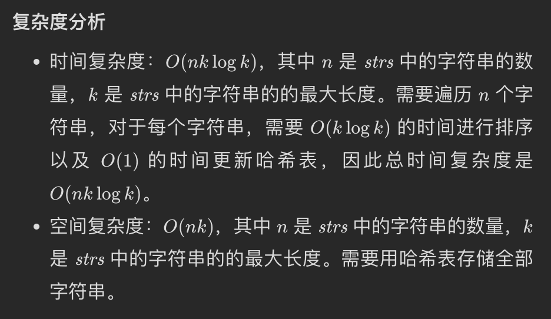

## [53. 最大子数组和](https://leetcode.cn/problems/maximum-subarray/)✅ 

https://www.acwing.com/video/1390/

简单的动态规划。

基础写法：

```c++
class Solution {
public:
    int maxSubArray(vector<int>& nums) {
        int n = nums.size();
        vector<int> dp(n);
        dp[0] = nums[0];
        int ans = dp[0];
        for (int i = 1; i < n; ++i) {
            if (dp[i-1] <= 0) dp[i] = nums[i];
            else dp[i] = nums[i] + dp[i - 1];
            ans = max(ans, dp[i]);
        }
        return ans;
    }
};
```

空间优化（滚动数组）

```c++
class Solution {
public:
    int maxSubArray(vector<int>& nums) {
        int n = nums.size();
        int ans = INT_MIN;
        for (int i = 0, last = 0; i < n; ++i) {
            int cur = nums[i] + max(0, last);
            ans = max(ans, cur);
            last = cur;
        }
        return ans;
    }
};
```

本题还可以用分治法来写。

## [55. 跳跃游戏](https://leetcode.cn/problems/jump-game/)✅ 

https://www.acwing.com/video/1392/

题意分析：能跳到的位置一定是连续的一段。

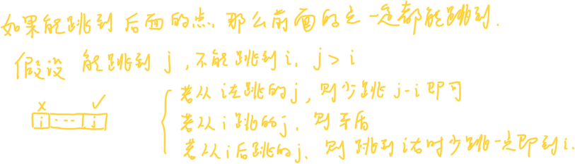

```c++
class Solution {
   public:
    int farthest = 0;
    bool canJump(vector<int>& nums) {
        int n = nums.size(), i;
        for (i = 0; i < n; ++i) {
            // farthest 维护i前面所有点能到的最远的位置，初始为0
            // 最远都到不了i，说明i前面断了
            if (farthest < i) return false;
            farthest = max(farthest, nums[i] + i);
        }
        // 执行完循环都没有断掉，说明最后一个点也和前面连起来了
        return true;
    }
};
```


## [56. 合并区间](https://leetcode.cn/problems/merge-intervals/)✅ 

https://www.acwing.com/activity/content/problem/content/2401/

时间复杂度：O(nlogn)，其中 n 为区间的数量。除去排序的开销，我们只需要一次线性扫描，所以主要的时间开销是排序的 O(nlogn)。

空间复杂度：O(logn)，其中 n 为区间的数量。这里计算的是存储答案之外，使用的额外空间。O(logn) 即为排序所需要的空间复杂度。

```c++
// sort 2d vector
bool sortfirst(const vector<int>& a, const vector<int>& b) {
    return a[0] < b[0];
}
class Solution {
   public:
    vector<vector<int>> res;

    vector<vector<int>> merge(vector<vector<int>>& intervals) {
        sort(intervals.begin(), intervals.end(), sortfirst);
        int st = INT_MIN, ed = INT_MIN + 1;
        for (auto& range : intervals) {
            if (range[0] > ed) {
                if (st != INT_MIN) res.push_back({st, ed});
                st = range[0], ed = range[1];
            } else {
                ed = max(ed, range[1]);
            }
        }
        res.push_back({st, ed});
        return res;
    }
};
```

## [62. 不同路径](https://leetcode.cn/problems/unique-paths/)✅ 

https://www.acwing.com/activity/content/problem/content/2407/

组合数学

```c++
class Solution {
public:
    int uniquePaths(int m, int n) {
        int i, j; 
        long long res = 1;

        for (i = 1; i < n; ++i) {
            j = i + m - 1;
            res = res * j / i;
        }

        return res;
    }
};
```

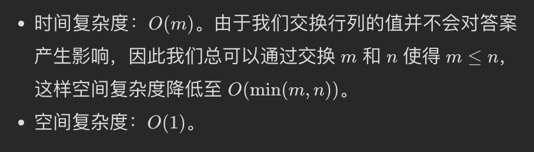

DP

```c++
int f[110][110];

class Solution {
public:
    int uniquePaths(int m, int n) {
        for (int i = 0; i < m; ++i) f[i][0] = 1;
        for (int j = 0; j < n; ++j) f[0][j] = 1;
        for (int i = 1; i < m; ++i) 
            for (int j = 1; j < n; ++j)
                f[i][j] = f[i - 1][j] + f[i][j - 1];
        return f[m - 1][n - 1];
    }
};
```

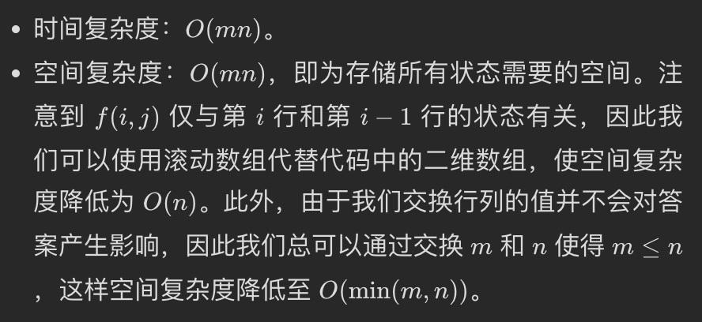

## [64. 最小路径和](https://leetcode.cn/problems/minimum-path-sum/)✅ 

https://www.acwing.com/video/1402/

```c++
int f[210][210];
class Solution {
   public:
    int minPathSum(vector<vector<int>>& grid) {
        int m = grid.size(), n = grid[0].size(), i, j;

        // 初始化dp数组
        memset(f, 0x3f, sizeof(f));

        for (int i = 0; i < m; ++i)
            for (int j = 0; j < n; ++j) {
                if (!i && !j)
                    f[i][j] = grid[i][j];
                else {
                    if (i) f[i][j] = min(f[i][j], f[i - 1][j] + grid[i][j]);
                    if (j) f[i][j] = min(f[i][j], f[i][j - 1] + grid[i][j]);
                }
            }
        return f[m - 1][n - 1];
    }
};
```


## [70. 爬楼梯](https://leetcode.cn/problems/climbing-stairs/)✅ 

https://www.acwing.com/activity/content/problem/content/2415/

```c++
class Solution {
public:
    int climbStairs(int n) {
        int f[50];
        f[0] = f[1] = 1;
        for (int i = 2; i <= n; ++i) f[i] = f[i - 1] + f[i - 2];
        return f[n];
    }
};
```


## [72. 编辑距离](https://leetcode.cn/problems/edit-distance/)✅ 

https://www.acwing.com/activity/content/problem/content/2421/

DP. 状态数 $n^2$, 转移方程O(1)


```c++
class Solution {
   public:
    int minDistance(string word1, string word2) {
        int n = word1.size(), m = word2.size(), i, j;
        // 让字符串下标从1开始，和状态表示中的定义一致
        word1 = ' ' + word1, word2 = ' ' + word2;
        vector<vector<int>> f(n + 1, vector<int>(m + 1));
        // 初始化
        for (i = 0; i <= n; ++i) f[i][0] = i;
        for (i = 0; i <= m; ++i) f[0][i] = i;
        for (i = 1; i <= n; ++i)
            for (j = 1; j <= m; ++j) {
                f[i][j] = min(f[i - 1][j], f[i][j - 1]) + 1;
                f[i][j] =
                    min(f[i][j], f[i - 1][j - 1] + int(word1[i] != word2[j]));
            }
        // A[1-n] B[1-m]
        return f[n][m];
    }
};
```


## [75. 颜色分类](https://leetcode.cn/problems/sort-colors/)✅ 

https://www.acwing.com/activity/content/problem/content/2424/

退出条件：i > k，此时没有未定元素

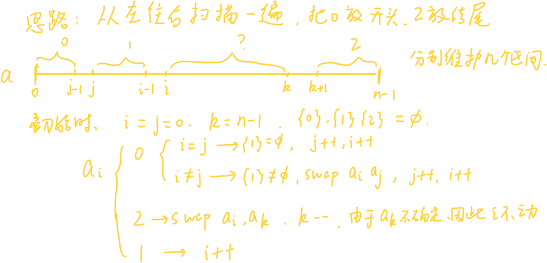

```c++
class Solution {
   public:
    void sortColors(vector<int>& nums) {
        int n = nums.size(), i, j, k;
        for (i = 0, j = 0, k = n - 1; i <= k; ++i) {
            if (nums[i] == 0) {
                swap(nums[i], nums[j++]);
            } else if (nums[i] == 2) {
                swap(nums[i--], nums[k--]);
            }
        }
    }
};
```

## [76. 最小覆盖子串](https://leetcode.cn/problems/minimum-window-substring/)✅ 

https://www.acwing.com/activity/content/problem/content/2425/

对于 `t` 中重复字符，我们寻找的子字符串中该字符数量必须不少于 `t` 中该字符数量。

因此我们需要分别统计 t 和 s子串中所有字符的出现情况。

所有以i为右边界的子串中，维护一个左边界j，使得[i,j]满足覆盖要求且最短。不难发现单调性：当i向右移动时，j不可能向左移动，因此只用扫描一遍 s。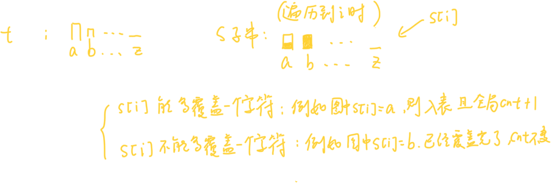

j 何时可以向后移动呢？当a~j~ 在T中出现次数小于在S子串中出现次数时。

```c++
class Solution {
   public:
    string minWindow(string s, string t) {
        // 哈希表统计字符数据
        unordered_map<char, int> src, tar;
        int n = s.size(), m = t.size(), i, j, cnt = 0;
        string ans;
        // 统计t里每个字符出现的次数
        for (auto c : t) {
            tar[c] += 1;
        }
        // 遍历子串的右边界i
        for (i = 0, j = 0; i < n; ++i) {
            //维护对应的最优左边界j
            // 当前入表字符: s[i]
            src[s[i]] += 1;
            if (src[s[i]] <= tar[s[i]]) cnt++;
            if (cnt == m) {
                // 更新左边界
                while (tar[s[j]] < src[s[j]]) src[s[j++]]--;
                if (ans.empty() || i - j + 1 < int(ans.size()))
                    ans = s.substr(j, i - j + 1);
            }
        }
        return ans;
    }
};
```


## [78. 子集](https://leetcode.cn/problems/subsets/)✅ 

https://www.acwing.com/activity/content/31/

递归法（dfs）

```c++
class Solution {
   public:
    vector<vector<int>> res;
    vector<int> path;
    vector<vector<int>> subsets(vector<int>& nums) {
        dfs(0, nums);
        return res;
    }

    void dfs(int u, vector<int>& nums) {
        if (u == nums.size()) {
            res.push_back(path);
            return;
        }
        // 选第u个数
        path.push_back(nums[u]);
        dfs(u + 1, nums);
        // 不选第u个数
        path.pop_back();
        dfs(u + 1, nums);
    }
};
```

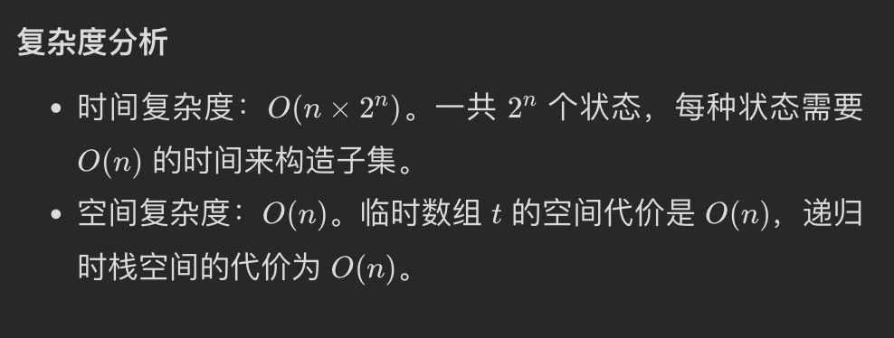

迭代法：

```c++
class Solution {
   public:
    vector<vector<int>> subsets(vector<int>& nums) {
        // 用二进制数代表选不选某个位置的数
        vector<vector<int>> res;
        int n = nums.size(), i, j;
        for (i = 0; i < 1 << n; ++i) { 
          // i的二进制表示从右往左数第j位是1还是0，代表选还是不选nums[j]
            vector<int> path;
            for (int j = 0; j < n; ++j) {
                if ((i >> j) & 1) path.push_back(nums[j]);
            }
            res.push_back(path);
        }
        return res;
    }
};
```


## [79. 单词搜索](https://leetcode.cn/problems/word-search/)✅ 

https://www.acwing.com/activity/content/problem/content/2428/

暴力搜索

```c++

class Solution {
   public:
    bool exist(vector<vector<char>>& board, string word) {
        int n = board.size(), m = board[0].size(), i, j;
        // 枚举起点
        for (i = 0; i < n; ++i) {
            for (int j = 0; j < m; ++j) {
                if (dfs(board, word, 0, i, j)) return true;
            }
        }
        return false;
    }
    int dx[4] = {0, 1, 0, -1}, dy[4] = {1, 0, -1, 0};
    // 从board[i][j]开始搜索, 当前搜索index=u的字符
    bool dfs(vector<vector<char>>& board, string word, int u, int x, int y) {
        if (word[u] != board[x][y]) return false;
        if (u == word.size() - 1) return true;

        // 因为每次搜索不能后退，所以在当前路径上要把搜过的节点标记一下
        auto t = board[x][y];
        board[x][y] = '.';
        for (int i = 0; i < 4; ++i) {
            int a = x + dx[i], b = y + dy[i];
            if (a < 0 || a >= board.size() || b < 0 || b >= board[0].size() ||
                board[a][b] == '.')
                continue;
            if (dfs(board, word, u + 1, a, b)) return true;
        }
        board[x][y] = t;
        return false;
    }
};
```


## [84. 柱状图中最大的矩形](https://leetcode.cn/problems/largest-rectangle-in-histogram/)✅ 

https://www.acwing.com/activity/content/problem/content/2433/


如何枚举所有情况？更容易想到的做法当然是枚举矩形的左右边界。但是本题我们可以枚举矩形的上边界。因为下边界是一定的，所以确定上边界，便能确定当前上边界的矩形最大面积：左右边界贪心即可。

```
for i = 0 ~ n-1
		当前上边界height[i]
		向左找到第一个比它矮的矩形j，若没有，则j=-1
		向右找到第一个比它矮的矩形k，若没有，则k=n
		宽度 [j+1,k-1] -> k-j-1
		高度 height[i]
```

然后很容易发现，其中最关键的步骤，可以用单调栈模型，事先扫描两遍，将每个 i 对应的 j k 保存起来。

```c++

class Solution {
   public:
    int largestRectangleArea(vector<int>& heights) {
        int n = heights.size(), i;
        vector<int> left(n), right(n);
        stack<int> stk;
        for (i = 0; i < n; ++i) {
            while (stk.size() && heights[stk.top()] >= heights[i]) stk.pop();
            if (stk.empty())
                left[i] = -1;
            else
                left[i] = stk.top();
            stk.push(i);
        }
        stk = stack<int>();
        for (i = n - 1; i >= 0; --i) {
            while (stk.size() && heights[stk.top()] >= heights[i]) stk.pop();
            if (stk.empty())
                right[i] = n;
            else
                right[i] = stk.top();
            stk.push(i);
        }

        int ans = 0;
        for (i = 0; i < n; ++i) {
            ans = max(ans, heights[i] * (right[i] - left[i] - 1));
        }
        return ans;
    }
};
```


## [85. 最大矩形](https://leetcode.cn/problems/maximal-rectangle/)✅ 

https://leetcode.cn/problems/maximal-rectangle/

考虑怎么枚举到所有的方案。枚举左上角、右下角、判断是否全1：O(n^6^)。如何优化？

联想到上一题的模型：柱状图中最大的矩形，我们也可以先确定下边界，然后看每个横坐标向上最多有多少连续的 1. 这样枚举下边界O(n)，柱状图中最大的矩形O(n)，总共只需要O(n^2^)的时间复杂度。

因此我们可以预处理出每个点向上最多有多少连续的1.

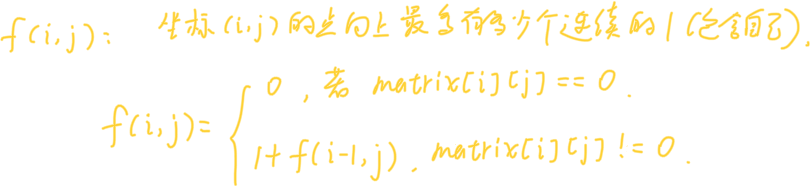

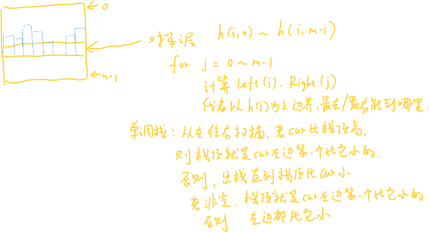

```c++
class Solution {
   public:
    int maximalRectangle(vector<vector<char>>& matrix) {
        int n = matrix.size(), m = matrix[0].size(), i, j;
        // 存储每个点向上最多有多少连续的 1
        vector<vector<int>> h(n, vector<int>(m));
        // dp
        for (i = 0; i < n; ++i) {
            for (j = 0; j < m; ++j) {
                if (matrix[i][j] == '1') {
                    if (i)
                        h[i][j] = h[i - 1][j] + 1;
                    else
                        h[i][j] = 1;
                }
            }
        }

        int ans = 0;
        for (i = 0; i < n; ++i) {
            vector<int> left(m), right(m);
            stack<int> stk;
            for (j = 0; j < m; ++j) {
                while (stk.size() && h[i][stk.top()] >= h[i][j]) stk.pop();
                if (stk.empty())
                    left[j] = -1;
                else
                    left[j] = stk.top();
                stk.push(j);  // 注意一定要push
            }
            stk = stack<int>();
            for (j = m - 1; j >= 0; j--) {
                while (stk.size() && h[i][stk.top()] >= h[i][j]) stk.pop();
                if (stk.empty())
                    right[j] = m;
                else
                    right[j] = stk.top();
                stk.push(j);  // 不要忘了push
            }

            for (j = 0; j < m; ++j) {
                ans = max(ans, h[i][j] * (right[j] - left[j] - 1));
            }
        }
        return ans;
    }
};
```


## [94. 二叉树的中序遍历](https://leetcode.cn/problems/binary-tree-inorder-traversal/)✅ 

https://www.acwing.com/activity/content/problem/content/2447/

中序遍历：左子树 → 自己 → 右子树

递归写法：

```c++
class Solution {
   public:
    vector<int> res;
    vector<int> inorderTraversal(TreeNode *root) {
        dfs(root);
        return res;
    }
    void dfs(TreeNode *root) {
        if (!root) return;
        if (root->left) dfs(root->left); // 这里不需要判断
        res.push_back(root->val);
        if (root->right) dfs(root->right); // 这里不需要判断
    }
};
```

迭代写法：

因为递归隐式地维护了一个栈，实际上可以在迭代的时候模拟出来。在理解的基础上记忆。

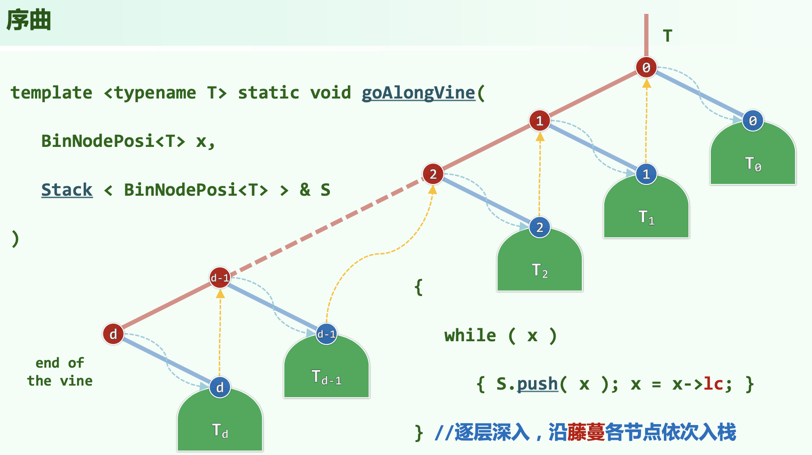

```c++
class Solution {
   public:
    vector<int> inorderTraversal(TreeNode *root) {
        stack<TreeNode *> stk;
        vector<int> res;
        // 当根不为空或栈不为空，说明还有节点尚未遍历；
        // 否则所有节点已经遍历完毕
        while (root || stk.size()) {
            // 先沿左边一直走，并把路上所有节点入栈
            while (root) stk.push(root), root = root->left;
            // 此时栈顶即是本轮将遍历的元素
            // 这里栈不可能为空，如果上一轮栈为空，那进循环的时候就保证了root不为空，有新元素进栈
            root = stk.top(), stk.pop();
            res.push_back(root->val);
            // 按左中右的顺序，跳到右子树
            root = root->right;
        }
        return res;
    }
};
```

## [144. 二叉树的前序遍历](https://leetcode.cn/problems/binary-tree-preorder-traversal/)✅ 

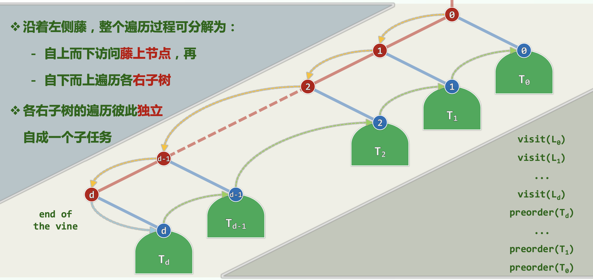

```c++
class Solution {
   public:
    vector<int> preorderTraversal(TreeNode *root) {
        vector<int> res;
        stack<TreeNode *> stk;
        while (root || stk.size()) {
            while (root)
                res.push_back(root->val), stk.push(root), root = root->left;
            root = stk.top()->right, stk.pop();
        }
        return res;
    }
};
```


## [145. 二叉树的后序遍历](https://leetcode.cn/problems/binary-tree-postorder-traversal/)✅ 

```c++
class Solution {
   public:
    vector<int> postorderTraversal(TreeNode *root) {
        vector<int> res;
        stack<TreeNode *> stk;
        // 左右根 -> 根右左
        while (root || stk.size()) {
            while (root)
                stk.push(root), res.push_back(root->val), root = root->right;
            root = stk.top()->left, stk.pop();
        }
        reverse(res.begin(), res.end());
        return res;
    }
};
```


## [96. 不同的二叉搜索树](https://leetcode.cn/problems/unique-binary-search-trees/)

https://www.acwing.com/video/1441/

```c++
// 数学归纳法的思想，但会超时
class Solution {
public:
    int numTrees(int n) {
        int res = 0;
        // 基础
        if (n == 1 || n == 0/*后验初始化*/) return 1;  
        // 归纳
        for (int i = 1; i <= n; ++i) {
            res += numTrees(i - 1) * numTrees(n - i);
        }
        return res;
    }
};
```

```c++
class Solution {
public:
    int numTrees(int n) {
        int res = 0;
        vector<int> f(n + 1);
        f[0] = 1;
        for (int i = 1; i <= n; ++i) { // 枚举n
            for (int j = 1; j <= i; ++j) { // 枚举根节点
                f[i] += f[j - 1] * f[i - j]; // 左边所有方案*右边所有方案
            }
        }
        return f[n];
    }
};
```

## [98. 验证二叉搜索树](https://leetcode.cn/problems/validate-binary-search-tree/)

https://www.acwing.com/video/1443/

```c++
// 错误示范：这样不能保证左子树中所有值都小于当前节点，因为这样写只能验证一层。正确做法是保证左子树中最大值小于当前节点
class Solution {
public:
    bool isValidBST(TreeNode* root) {
        if (!root) return true;
        if (root->left && root->left->val >= root->val) return false;
        if (root->right && root->right->val <= root->val) return false;
        return isValidBST(root->left) && isValidBST(root->right);
    }
};
```

```c++
class Solution {
public:
    bool isValidBST(TreeNode* root) {
        return dfs(root, LLONG_MIN, LLONG_MAX);
    }
    bool dfs(TreeNode* root, long long left_max, long long right_max) {
        if (!root) return true;
        if (root->val <= left_max || root->val >= right_max) return false;
        return dfs(root->left, left_max, root->val) && dfs(root->right, root->val, right_max);
    }
};
```

```c++
```


## [101. 对称二叉树](https://leetcode.cn/problems/symmetric-tree/)

## [102. 二叉树的层序遍历](https://leetcode.cn/problems/binary-tree-level-order-traversal/)

## [104. 二叉树的最大深度](https://leetcode.cn/problems/maximum-depth-of-binary-tree/)

## [105. 从前序与中序遍历序列构造二叉树](https://leetcode.cn/problems/construct-binary-tree-from-preorder-and-inorder-traversal/)

## [114. 二叉树展开为链表](https://leetcode.cn/problems/flatten-binary-tree-to-linked-list/)

## [121. 买卖股票的最佳时机](https://leetcode.cn/problems/best-time-to-buy-and-sell-stock/)

## [124. 二叉树中的最大路径和](https://leetcode.cn/problems/binary-tree-maximum-path-sum/)

## [128. 最长连续序列](https://leetcode.cn/problems/longest-consecutive-sequence/)

## [136. 只出现一次的数字](https://leetcode.cn/problems/single-number/)

## [139. 单词拆分](https://leetcode.cn/problems/word-break/)

## [141. 环形链表](https://leetcode.cn/problems/linked-list-cycle/)

## [142. 环形链表 II](https://leetcode.cn/problems/linked-list-cycle-ii/)


## [146. LRU 缓存](https://leetcode.cn/problems/lru-cache/)

## [148. 排序链表](https://leetcode.cn/problems/sort-list/)

## [152. 乘积最大子数组](https://leetcode.cn/problems/maximum-product-subarray/)

## [155. 最小栈](https://leetcode.cn/problems/min-stack/)

## [160. 相交链表](https://leetcode.cn/problems/intersection-of-two-linked-lists/)

## [169. 多数元素](https://leetcode.cn/problems/majority-element/)

## [198. 打家劫舍](https://leetcode.cn/problems/house-robber/)

## [200. 岛屿数量](https://leetcode.cn/problems/number-of-islands/)

## [206. 反转链表](https://leetcode.cn/problems/reverse-linked-list/)

## [207. 课程表](https://leetcode.cn/problems/course-schedule/)

## [208. 实现 Trie (前缀树)](https://leetcode.cn/problems/implement-trie-prefix-tree/)

## [215. 数组中的第K个最大元素](https://leetcode.cn/problems/kth-largest-element-in-an-array/)

## [221. 最大正方形](https://leetcode.cn/problems/maximal-square/)

## [226. 翻转二叉树](https://leetcode.cn/problems/invert-binary-tree/)

## [234. 回文链表](https://leetcode.cn/problems/palindrome-linked-list/)

## [236. 二叉树的最近公共祖先](https://leetcode.cn/problems/lowest-common-ancestor-of-a-binary-tree/)

## [238. 除自身以外数组的乘积](https://leetcode.cn/problems/product-of-array-except-self/)

## [239. 滑动窗口最大值](https://leetcode.cn/problems/sliding-window-maximum/)

## [240. 搜索二维矩阵 II](https://leetcode.cn/problems/search-a-2d-matrix-ii/)

## [279. 完全平方数](https://leetcode.cn/problems/perfect-squares/)

## [283. 移动零](https://leetcode.cn/problems/move-zeroes/)

## [287. 寻找重复数](https://leetcode.cn/problems/find-the-duplicate-number/)

## [297. 二叉树的序列化与反序列化](https://leetcode.cn/problems/serialize-and-deserialize-binary-tree/)

## [300. 最长递增子序列](https://leetcode.cn/problems/longest-increasing-subsequence/)

## [301. 删除无效的括号](https://leetcode.cn/problems/remove-invalid-parentheses/)

## [301. 删除无效的括号](https://leetcode.cn/problems/remove-invalid-parentheses/)

## [309. 最佳买卖股票时机含冷冻期](https://leetcode.cn/problems/best-time-to-buy-and-sell-stock-with-cooldown/)

## [312. 戳气球](https://leetcode.cn/problems/burst-balloons/)

## [322. 零钱兑换](https://leetcode.cn/problems/coin-change/)

## [337. 打家劫舍 III](https://leetcode.cn/problems/house-robber-iii/)

## [338. 比特位计数](https://leetcode.cn/problems/counting-bits/)

## [347. 前 K 个高频元素](https://leetcode.cn/problems/top-k-frequent-elements/)

## [394. 字符串解码](https://leetcode.cn/problems/decode-string/)

## [399. 除法求值](https://leetcode.cn/problems/evaluate-division/)

## [406. 根据身高重建队列](https://leetcode.cn/problems/queue-reconstruction-by-height/)

## [416. 分割等和子集](https://leetcode.cn/problems/partition-equal-subset-sum/)

## [437. 路径总和 III](https://leetcode.cn/problems/path-sum-iii/)

## [438. 找到字符串中所有字母异位词](https://leetcode.cn/problems/find-all-anagrams-in-a-string/)

## [448. 找到所有数组中消失的数字](https://leetcode.cn/problems/find-all-numbers-disappeared-in-an-array/)

## [461. 汉明距离](https://leetcode.cn/problems/hamming-distance/)

## [494. 目标和](https://leetcode.cn/problems/target-sum/)

## [538. 把二叉搜索树转换为累加树](https://leetcode.cn/problems/convert-bst-to-greater-tree/)

## [543. 二叉树的直径](https://leetcode.cn/problems/diameter-of-binary-tree/)

https://www.acwing.com/video/2001/

不一定过根节点。


## [560. 和为 K 的子数组](https://leetcode.cn/problems/subarray-sum-equals-k/)✅ 

https://www.acwing.com/video/2021/

## [581. 最短无序连续子数组](https://leetcode.cn/problems/shortest-unsorted-continuous-subarray/)✅ 

https://www.acwing.com/video/2040/

```c++
class Solution {
public:
    int findUnsortedSubarray(vector<int>& nums) {
        vector<int> sort_nums(nums); // 初始化方式
        sort(sort_nums.begin(), sort_nums.end());
        int n = nums.size(), l, r;
        for (l = 0; l < n; ++l) if (nums[l] != sort_nums[l]) break;
        for (r = n - 1; r >= 0; --r) if (nums[r] != sort_nums[r]) break;
        if (l >= r) return 0;
        else return r - l + 1;
    }
};
```

```c++
class Solution {
public:
    int findUnsortedSubarray(vector<int>& nums) {
        int l = 0, r = nums.size() - 1;
        while (l + 1 < nums.size() && nums[l + 1] >= nums[l]) l ++ ;
        if (l == r) return 0;
        while (r - 1 >= 0 && nums[r - 1] <= nums[r]) r -- ;
        for (int i = l + 1; i < nums.size(); i ++ )
            while (l >= 0 && nums[l] > nums[i])
                l -- ;
        for (int i = r - 1; i >= 0; i -- )
            while (r < nums.size() && nums[r] < nums[i])
                r ++ ;
        return r - l - 1;

    }
};
```


## [617. 合并二叉树](https://leetcode.cn/problems/merge-two-binary-trees/)✅ 

```c++
class Solution {
public:
    TreeNode* mergeTrees(TreeNode* root1, TreeNode* root2) {
      	// 有一个为空
        if (!root1) return root2;
        if (!root2) return root1;
				// 都不为空
        root1->val += root2->val;
        root1->left = mergeTrees(root1->left, root2->left);
        root1->right = mergeTrees(root1->right, root2->right);
        return root1;
    }
};
```


## [621. 任务调度器](https://leetcode.cn/problems/task-scheduler/)✅ 

https://www.acwing.com/video/2103/

思维题，最重要是找切入点。

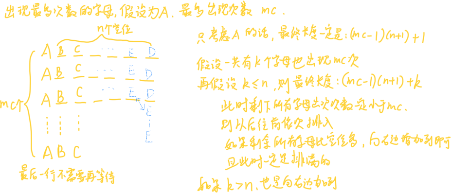

```c++
class Solution {
public:
    int leastInterval(vector<char>& tasks, int n) {
        vector<int> freq(26);
        for(auto c: tasks) freq[c - 'A']++;
        int maxfreq = *max_element(freq.begin(), freq.end());
        int k = 0;
        for (auto f: freq) if (f == maxfreq) k++;
        return max((int)tasks.size(), (maxfreq - 1) * (n + 1) + k);
    }
};
```


## [647. 回文子串](https://leetcode.cn/problems/palindromic-substrings/)✅ 

https://www.acwing.com/video/2156/

计算有多少个回文子串的最朴素方法就是枚举出所有的回文子串，而枚举出所有的回文字串又有两种思路，分别是：

* 枚举出所有的子串，然后再判断这些子串是否是回文；

* 枚举每一个可能的回文中心，然后用两个指针分别向左右两边拓展，当两个指针指向的元素相同的时候就拓展，否则停止拓展。

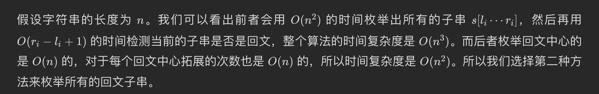

```c++
// 第二种枚举
class Solution {
public:
    int countSubstrings(string s) {
        int n = s.size(), res = 0, i, j, l, r;
        // 枚举中心点
        for (i = 0; i < n; ++i) {
            // 枚举奇偶，j=0时中心点为[i] j=1 -> [i,i+1]
            for (j = 0; j <= 1; ++j) {
                l = i, r = i + j;
                while (l >= 0 && r < n && s[l] == s[r]) l--, r++, res++;
            }
        }
        return res;
    }
};

// 第一种枚举
class Solution {
public:
    int countSubstrings(string s) {
        int n = s.size(), res = n, i, j, l, r;
        for (i = 2; i <= n; ++i) { // 枚举子串的长度
            for (j = 0; j < n - i + 1; ++j) {// 枚举子串的开始位置
                l = j, r = j + i - 1;
                while (l < r && s[l] == s[r]) l++, r--;
                if (l >= r) res += 1;
            }
        }
        return res;
    }
};
```


## [739. 每日温度](https://leetcode.cn/problems/daily-temperatures/)✅ 

单调栈模板题。

```c++
class Solution {
public:
    vector<int> dailyTemperatures(vector<int>& temperatures) {
        int n = temperatures.size(), i, j;
        stack<int> stk;
        vector<int> res(n);
        for (i = n - 1; i >= 0; --i) {
            while (stk.size() && temperatures[i] >= temperatures[stk.top()]) stk.pop();
            // if (stk.empty()) res[i] = 0;
            if (stk.size()) res[i] = stk.top() - i;
            stk.push(i);
        }
        return res;
    }
};
```


# Weekly Contest

## [第 88 场双周赛](https://leetcode.cn/contest/biweekly-contest-88/)

### 删除字符使频率相同✅ 

实际上ez题直接模拟即可：

```c++
class Solution {
 public:
  bool equalFrequency(string word) {
    int n = word.size(), i, j;
    for (i = 0; i < n; ++i) {  // i为删除的字符的下标
      vector<int> s(26);
      for (j = 0; j < n; ++j) {
        if (j != i) s[word[j] - 'a']++;
      }
      // 此时判断所有s中所有非0元素是否相等即可
      int val = *max_element(s.begin(), s.end());  // 库函数
      for (j = 0; j < 26; j++) {
        if (s[j] && s[j] != val) break;
      }
      if (j == 26) return true;
    }
    return false;
  }
};
```

我的代码：考虑了很多边界情况，非常复杂

```c++
class Solution {
public:
    bool equalFrequency(string word) {
        vector<int> f(26);
        for (auto c: word) {
            f[c - 'a'] += 1;
        }
        vector<int> ans;
        for (int i = 0; i < 26; ++i) {
            if (f[i]) ans.push_back(f[i]);
        }
        if (ans.size() <= 1) return true;
        sort(ans.begin(), ans.end());
        int delta = ans[0];
        
        for (auto& a: ans) {
            a -= delta;
        }
        
        if (delta != 1) {
            return ans[ans.size() - 1] == 1;
        } else {
            bool eq = true;
            int i = 1;
            for (; i < ans.size() - 1; ++i) {
                if (ans[i + 1] != ans[i]) {
                    eq = false;
                    break;
                }
            }
            if (eq) return true;
            if (i == ans.size() - 2) return ans[i + 1] == 1;
            else return false;
        }
        return false;
    }
        
};
```


### 最长上传前缀✅ 

```c++
class LUPrefix {
  int sum;
  bool b[100005];

 public:
  LUPrefix(int n) {
    sum = 0;
    memset(b, 0, sizeof(b));
  }

  void upload(int video) {
    b[video] = 1;
    for (; b[sum + 1]; sum++)
      ;
  }

  int longest() { return sum; }
};
```

我的代码：

```c++
class LUPrefix {
public:
    priority_queue<int, vector<int>, greater<int>> pool;
    vector<int> pre;
    
    LUPrefix(int n) {
        pre.reserve(n);
    }
    
    void upload(int video) {
        if (video == pre.size() + 1) pre.push_back(video);
        else pool.push(video);
    }
    
    int longest() {
        while (!pool.empty() && pool.top() == pre.size() + 1) {pre.push_back(pool.top()); pool.pop();}
        return pre.size();
        
    }
};
```

### 所有数对的异或和✅ 

```c++
class Solution {
public:
    int xorAllNums(vector<int>& nums1, vector<int>& nums2) {
        int s=0;
        if(nums1.size()&1)for(auto &c:nums2)s^=c;
        if(nums2.size()&1)for(auto &c:nums1)s^=c;
        return s;
    }
};
```

### 满足不等式的数对数目

```c++
class Solution {
    int t[40005];
public:
    long long numberOfPairs(vector<int>& nums1, vector<int>& nums2, int diff) {
        int n=nums1.size(),i,j;
        memset(t,0,sizeof(t));
        long long ans=0;
        const int m=20001;
        for(i=0;i<n;i++)
        {
            for(j=min(max(nums1[i]-nums2[i]+diff+m,0),40004);j;j^=j&-j)ans+=t[j];
            for(j=nums1[i]-nums2[i]+m;j<40005;j+=j&-j)t[j]++;
        }
        return ans;
    }
};
```

## 第 287 场周赛

### [转化时间需要的最少操作数](https://leetcode.cn/problems/minimum-number-of-operations-to-convert-time/)✅ 

题意：给你一个数，应该分成多少个1、5、15、60？

> * 优化问题→单调性→贪心
>
> 当且仅当任意货币面值均存在倍数关系时贪心成立

看起来是一个完全背包的模型，但是解法有很大差异。主要原因一是这里“价值”=“体积”，而一般的完全背包这两个是没有关系的；二是关心的问题不一样，这里我们关心如何分成这几个数。那么首先，一定存在这样的划分吗？显然，一定存在的条件是：这几个数的线性组合占满所有整数空间。这里因为有 1 的存在，必然满足条件。

因此，只用考虑如何划分。我们要求最少的划分数，很容易想到贪心。因为这里的所有数都是比它小的数的倍数，若我们能划分出一个大数，却选择划分多个小数来代替的话，操作数一定会变多。所以从大到小，每个数取到不能再取为止。

```c++
class Solution {
public:
    int convertTime(string current, string correct) {
        int time1 = stoi(current.substr(0, 2)) * 60 + stoi(current.substr(3, 2));
        int time2 = stoi(correct.substr(0, 2)) * 60 + stoi(correct.substr(3, 2));
        int diff = time2 - time1;   // 需要增加的分钟数
        int res = 0;
        // 尽可能优先使用增加数值更大的操作
        vector<int> ops = {60, 15, 5, 1};
        for (int t: ops) {
            res += diff / t; // 这里不用写循环来减
            diff %= t;
        }
        return res;
    }
};
```

### [找出输掉零场或一场比赛的玩家](https://leetcode.cn/problems/find-players-with-zero-or-one-losses/)✅ 

题意：给你一组有序对，找出所有在second位置只出现一次的元素(1)和一次都没有出现在second但有在first中出现的元素(2)。

(1)比较容易，直接统计所有second元素中只重复一次的元素。(2)就不能只看没有在second出现的元素，还要综合考虑first。因此考虑用哈希表实现，只要参加过比赛的选手都会存起来，这样没参加比赛的就不会被遍历到。

```c++
class Solution {
public:
    vector<vector<int>> findWinners(vector<vector<int>>& matches) {
        unordered_map<int, int> player;
        for (auto match: matches) { // 用unordered_map统计参赛情况
            player[match[0]] += 0;
            player[match[1]] += 1;
        }
        vector<vector<int>> res(2);
        for (auto [k, v]: player) { //遍历unordered_map的写法
            if (v <= 1) res[v].push_back(k);
        }
        for (int i = 0; i < 2; ++i) //unordered_map存储元素是无序的，所以这里要排序. 如果用map就不用排序
        		sort(res[i].begin(), res[i].end());
        return res;
    }
};
```

### [每个小孩最多能分到多少糖果](https://leetcode.cn/problems/maximum-candies-allocated-to-k-children/)✅ 

> * 优化问题→\to→判定问题→\to→阶跃函数→\to→二分
>
> 对任何的优化问题，都可尝试枚举答案，然后寻找判定时的单调性
>
> 如果有单调性，枚举答案的代价仅为log

题意：

```c++
 c[0],    c[1],		c[2],		..., 	c[n - 1]
/     \													/     \
t[0]...t[i]										t[j]... t[m]					
// 子堆任意分配，可以不分，也可以将它拆成c[i]个1
// 所有这些子堆的【子集】分配给k个小孩，要求每人得到的数目相同
// 求最大的数目
```

刚开始的思路：直接求的话，最大的分配数目和什么有关？

显然和k有关。如果 k ≤ c.size()，最大数目≥ min(c[i])，简化了很多但算起来还是很复杂。如果 k>sum(c[i])，那总数都不够每人分一个，输出肯定为0，反之如果k ≤ sum(c[i])，那最大数目≥1. 此外，由于不能合并多堆，那每个人最多只能得到max(c[i])……

可以发现，直接求的话由于子堆任意分配，情况十分复杂。我们转化思路，由于我们上面知道了最大数目的大致范围：[0, max(c[i])]，不妨枚举最大数目，然后验证这个取值是否合法。需要枚举10^7^次，每次验证是O(n)=O(10^5^)的，显然复杂度过高。继续思考，我们记最大数目为t，可以发现，如果t是合法的，那么t-1一定是合法的：只需要把每个分给小孩的子堆再分个1出来就可以了。那么t从0到max(c[i])，一定是前一段都合法，后一段都不合法。因此可以二分，总体复杂度变为O(nlogm).

```c++
class Solution {
public:
    int maximumCandies(vector<int>& candies, long long k) {
        // 判定合法 lambda表达式
        auto check = [&] (int t) -> bool {
            long long tot = 0;
            for (auto c: candies) tot += c / t;
            return tot >= k;
        };
				// 二分
        int r = *max_element(candies.begin(), candies.end()), l = 0;
        while (l < r) {
            int mid = l + r + 1 >> 1;
            if (check(mid)) l = mid;
            else r = mid - 1;
        }
        return l;
    } 
};
```

### [加密解密字符串](https://leetcode.cn/problems/encrypt-and-decrypt-strings/)✅ 

加密解密的过程都是映射的过程，所以用哈希表。本题要求解密后的字符串在dictionary出现的数目，实际上我们可以对dictionary预处理出每个字符串加密之后的字符串，看有多少和word2一样即可。

唯一需要注意的点在于，dictionary中有的字符串无法加密，那么由于加密解密的对称性，这些字符串显然也无法通过解密得到。需要特别注意这方面引起的bug。

```c++
class Encrypter {
    unordered_map<char, string> encode;
    unordered_map<string, int> dic_encode_freq;
public:
    Encrypter(vector<char>& keys, vector<string>& values, vector<string>& dictionary) {
        int n = keys.size();
        for (int i = 0; i < n; ++i) encode[keys[i]] = values[i];
        for (auto d: dictionary) dic_encode_freq[encrypt(d)]++;
    }
    
    string encrypt(string word1) {
        string res;
        for (auto c: word1) if (encode.count(c)) res += encode[c]; else return ""; // 特殊情况
        return res;
    }
    
    int decrypt(string word2) {
        return dic_encode_freq[word2];
    }
};
```

## 第236场周赛

### [数组元素积的符号](https://leetcode.cn/problems/sign-of-the-product-of-an-array/)

用 `res = -res` 比 `res *= -1`效率高很多

```c++
class Solution {
public:
    int arraySign(vector<int>& nums) {
        int res = 1;
        for (auto n: nums) if (n < 0) res = -res; else if (!n) return 0;
        return res;
    }
};
```

### [找出游戏的获胜者](https://leetcode.cn/problems/find-the-winner-of-the-circular-game/)

题意：约瑟夫环

##### 法一：直接链表模拟

```c++
const int N = 520;
int head, e[N], ne[N], idx; // idx: 链表size

class Solution {
public:
    int findTheWinner(int n, int k) {
        if (k == 1) return n;
        // 构造循环单链表 1->2->...->n
        head = 1;
        for (int i = 1; i <= n; ++i) e[i] = i, ne[i] =  i + 1;
        ne[n] = 1, idx = n;

        while (idx != 1) {
            for (int i = k; i > 2; i--) head = ne[head]; // head 为被删的人的前一个人
            ne[head] = ne[ne[head]];
            idx--;
            head = ne[head];
        }
        return e[head];
    }
};
```

##### 法二：数学推导


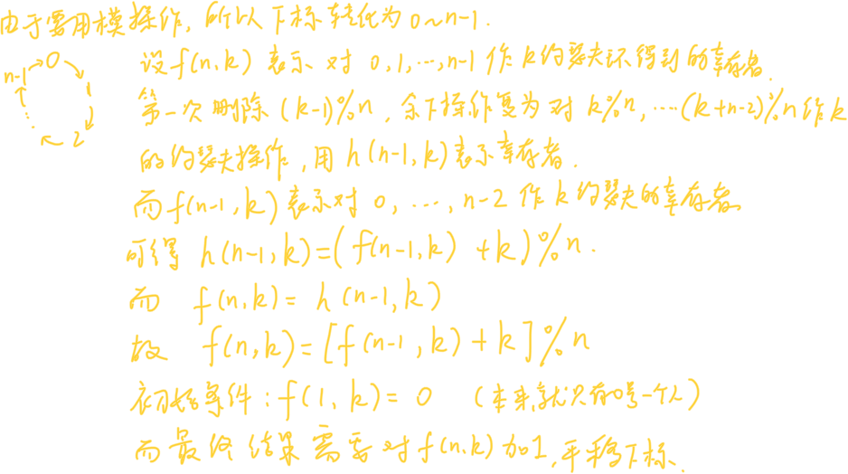

```c++
class Solution {
public:
    int f(int n, int k) {
        if (n == 1) return 0;
        return (f(n - 1, k) + k) % n;
    }
    int findTheWinner(int n, int k) {
        return f(n, k) + 1;
    }
};
```

```c++
// 迭代
class Solution {
public:
    int findTheWinner(int nn, int k) {
        int init = 0;
        for (int n = 2; n <= nn; ++n) {
            init = (init + k) % n;
            cout << init << endl;
        }
        return init + 1;
    }
};
```

### [最少侧跳次数](https://leetcode.cn/problems/minimum-sideway-jumps/)

题意：在一个3xn的网格上，青蛙从起始点到终点的最短距离。

> * 任意图→\to→拓扑图→\to→动态规划
>
> 有拓扑序的部分递推
>
> 没有拓扑序的部分暴力更新（比如迭代至收敛）

##### BFS    O(n)?

一个直观的思路是化归为最短路问题，边权为每一跳的代价：上下跳代价为1，向右跳代价为0. 于是转化为一张边权为0或1的图，因此可以使用 BFS 搜出最短路。这里与边权为1的唯一区别就是需要用双端队列，扩展0边得到的新节点加到队头，扩展1边得到的新节点加到队尾。本质上是一个 dijkstra 算法。

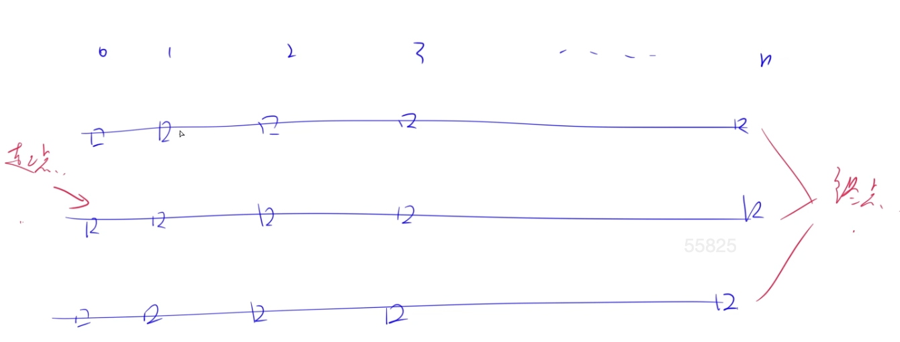

```c++
class Solution {
public:
    typedef pair<int, int> pii;

    int minSideJumps(vector<int>& obstacles) {
        int n = obstacles.size();
        vector<vector<int>> grid(4, vector<int>(n + 1, 1e9));
        deque<pii> dq;
        dq.push_back({2, 0}); // start position
        grid[2][0] = 0;

        int dx[5] = {1, 2, -1, -2, 0}, dy[5] = {0, 0, 0, 0, 1}, cost[5] = {1, 1, 1, 1, 0};

        while (dq.size()) {
            auto t = dq.front();
            dq.pop_front();
            if (t.second == n - 1) { // already get to t
                return grid[t.first][t.second];
            }
            // expand t
            for (int i = 0; i < 5; ++i) {
                int x = t.first + dx[i], y = t.second + dy[i];
                if (x >= 1 && x <= 3 && y >= 0 && y <= n && obstacles[y] != x) {
                    int dist = grid[t.first][t.second] + cost[i];
                    if (dist < grid[x][y]) {
                        grid[x][y] = dist;

                        if (cost[i]) dq.push_back({x, y});
                        else dq.push_front({x, y});
                    }
                }
            }
        }
        return 0;
    }
};
```

##### DP  O(n)

沿着上一种解法的思路进一步考虑，可以发现虽然整个有向图是没有拓扑序的（因为同一列的点会相互依赖），但是每一列的状态其实只和前一列有关，而和后一列无关（因为不能向左跳）。因此，这些列是有拓扑序的，这就引导我们使用DP来解这道题。

> DP的本质就是有向无环图（拓扑图），按照拓扑序进行递推

```c++
class Solution {
public:
    int minSideJumps(vector<int>& obstacles) {
        int n = obstacles.size() - 1;
        vector<vector<int>> dp(3, vector<int>(n + 1, 1e9));
        dp[0][0] = dp[2][0] = 1, dp[1][0] = 0; // init first layer
        for (int i = 1; i <= n; ++i) { // current layer
            int o = obstacles[i] - 1; // obstacle position
            for (int j = 0; j < 3; ++j) {
                if (j == o) continue;
                for (int k = 0; k < 3; ++k) { // layer i - 1 -> layer i
                    if (k == o) continue;
                    dp[j][i] = min(dp[j][i], dp[k][i - 1] + (int)(k != j));
                }
            }
        }
        return min(dp[0][n], min(dp[1][n], dp[2][n]));
    }
};
```

空间压缩：…

### [求出 MK 平均值](https://leetcode.cn/problems/finding-mk-average/)

> 使用固定大小的堆维护集合，堆顶元素给出边界值
>
> 为了给出边界，维护最小集合时使用大根堆，维护最大集合时使用小根堆
>
> 添加或删除元素时可根据边界定位，选择对应的堆进行操作

题意：维护一个大小为m的分段区间，由于它是在数据流上的一个滑动窗口，所以必须支持【插入】和【删除指定元素】的操作。那么数据流问题中常用的大根堆小根堆就不太适用了，需要用平衡树来动态维护，也就是c++ 中的 multiset（红黑树实现）

或者实现能够删除任意元素的优先队列。

需要两个优先队列。

```
最小的k个元素		|		中间的m-2k个元素  | 最大的k个元素
multiset			|		 multiset				|  multiset
[begin,rbegin]|	[begin, rbegin]		| [begin, rbegin]
```


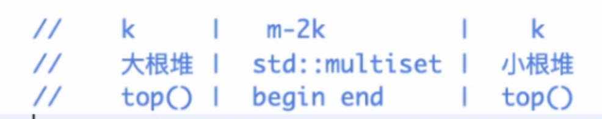

```c++
class MKAverage {
    typedef long long ll;
    int m, k;
    ll sum = 0;
    vector<int> ori; // 原始数据流
    multiset<int> smaller; //存数据流'最小的k个数
    multiset<int> bigger; // 存数据流'最大的k个数
    multiset<int> medium; // multiset存中间的 m - 2k 个数
public:
    MKAverage(int _m, int _k) {
        m = _m;
        k = _k;
    }
    
    void addElement(int num) {
        ori.push_back(num);
        if (ori.size() < m) return; // 数据流所有数不够m个时，不用管
        if (ori.size() == m) {      // 刚到m个时，开始初始化3个区间
            auto t = ori;
            sort(t.begin(), t.end());
            for (int i = 0; i < k; i++) smaller.insert(t[i]);
            for (int i = k; i < m - k; i++) medium.insert(t[i]), sum += t[i];
            for (int i = m - k; i < m; i++) bigger.insert(t[i]);
        } else {                    // 超过m时
            // 先判断应该加到哪个区间，如果应该加到左右区间，那么将多出来一个元素的统一移动到中间
            if (num <= *smaller.rbegin()) {
                smaller.insert(num);
                medium.insert(*smaller.rbegin()), sum += *smaller.rbegin();
                smaller.erase(--smaller.end());
            }
            else if (num >= *bigger.begin()) {
                bigger.insert(num);
                medium.insert(*bigger.begin()), sum += *bigger.begin();
                bigger.erase(bigger.begin());
            }
            else medium.insert(num), sum += num;
            // 再删除已经移出容器的数
            auto del = ori[ori.size() - m - 1];
            if (medium.count(del)) medium.erase(medium.find(del)), sum -= del;
            else if (smaller.count(del)) {
                smaller.erase(smaller.find(del));
                smaller.insert(*medium.begin());
                sum -= *medium.begin();
                medium.erase(medium.begin());
            } else {
                bigger.erase(bigger.find(del));
                bigger.insert(*medium.rbegin());
                sum -= *medium.rbegin();
                medium.erase(--medium.end());
            }

        }

    }
    
    int calculateMKAverage() {
        if (ori.size() < m) return -1;
        return sum / medium.size();
    }
};

/**
 * Your MKAverage object will be instantiated and called as such:
 * MKAverage* obj = new MKAverage(m, k);
 * obj->addElement(num);
 * int param_2 = obj->calculateMKAverage();
 */
```

### 带删除的优先队列

```c++
p {1,2,3,4,5}  q {}
删除3
p {1,2,3,4,5}  q {3}
删除1
p {2,3,4,5}    q {3}
删除2
p {3,4,5} 		 q {3}
读取堆顶
p {4,5} 			 q {}

删除x: if (p.top() == x) p.pop()
  		else q.push(x)
读取堆顶: while (p.top() == q.top()) p.pop(), q.pop();
				 return p.top();
```


## 第115场周赛

### [N 天后的牢房](https://leetcode.cn/problems/prison-cells-after-n-days/)

由于后一天的状态完全由前一天得到，且 8 位 2 进制数最多只有 256 种状态，因此若 n 足够大，必然进入循环。因此本题重点在于找到循环结。

> 若图中具有有限结点，且每个结点具有唯一后继，则该图中存在循环节，长度不超过结点个数

```c++
class Solution {
public:
    vector<int> prisonAfterNDays(vector<int>& cells, int n) {
        map<vector<int>, int> pool; // 这里不能使用unordered_map
        pool[cells] = 0;
        int i, len = 8, recur = -1;
        for (i = 1; i <= n; ++i) {
            cells = nextDay(cells);
            if (pool.count(cells)) {
                recur = i - pool[cells];
                break;
            }
            pool[cells] = i;
        } 
        if (i == n) return cells; // 这句可以省略，但注意逻辑上肯定要考虑没有进入循环结的情况
        for (int j = 0; j < (n - i) % recur; ++j) {
            cells = nextDay(cells);
        }
        return cells;
    }

    vector<int> nextDay(vector<int>& cells) {
        int n = cells.size(), i;
        vector<int> res(8);
        for (int i = 1; i < n - 1; i++) res[i] = !(cells[i-1]^cells[i+1]);
        res[0] = res[n - 1] = 0;
        return res;
    }
};
```


### [二叉树的完全性检验](https://leetcode.cn/problems/check-completeness-of-a-binary-tree/)

层序遍历。如果访问到空节点，直接看当前队列里有没有非空节点（因为当前队列里出现的节点都是在空节点后面的节点，必须为空）

```c++
class Solution {
public:
    bool isCompleteTree(TreeNode* root) {
        queue<TreeNode*> q;
        q.push(root);
        while (q.size()) {
            auto t = q.front();
            q.pop();
            if (!t) {
                while (q.size()) {
                    auto s = q.front();
                    q.pop();
                    if (s) return false;
                }
            }
            else q.push(t->left), q.push(t->right);
        }
        return true;
    }
};
```

### [由斜杠划分区域](https://leetcode.cn/problems/regions-cut-by-slashes/)

> 任何含有矩阵、图形等概念的问题
>
> 若其可以==抽象为对一个图的统计==
>
> 比如连通块计数、最大连通块大小、最短路
>
> 那么该问题本质上与前面的任何概念无关

题意：求连通块的数量


```c++
class Solution {
    int n;
    vector<int> p;
public:
    // (i, j, k) 表示某个单位区域，映射到一维的编号
    int get(int i, int j, int k) {
        // 第 i*n+j个格子
        return (i * n + j) * 4 + k;
    }

    int find(int i) {
        if (p[i] != i) p[i] = find(p[i]);
        return p[i];
    }

    int regionsBySlashes(vector<string>& grid) {
        // 划分为 4*n*n 个单位区域，给每个区域一个编号，则转化为并查集求连通块数量
        n = grid.size();
        for (int i = 0; i < 4*n*n; ++i) p.push_back(i);
        // 按照规则给单位区域连线
        int dx[] = {-1, 0, 1, 0}, dy[] = {0, 1, 0, -1};
        for (int i = 0; i < n; ++i) {
            for (int j = 0; j < n; ++j) {
                for (int k = 0; k < 4; ++k) {
                    // 当前单位区域(i,j,k) 对顶单位区域(i+dx[k],j+dy[k],k^2)  // 00 - 10, 01 - 11
                    int ni = i + dx[k], nj = j + dy[k], nk = k^2;
                    if (ni >= 0 && ni < n && nj >= 0 && nj < n) {
                        p[find(get(i, j, k))] = find(get(ni, nj, nk));
                    }
                }
                if (grid[i][j] == '/' || grid[i][j] == ' ') {
                    p[find(get(i, j, 1))] = find(get(i, j, 2));
                    p[find(get(i, j, 0))] = find(get(i, j, 3));
                }
                if (grid[i][j] == '\\' || grid[i][j] == ' ') {
                    p[find(get(i, j, 1))] = find(get(i, j, 0));
                    p[find(get(i, j, 2))] = find(get(i, j, 3));
                }
            }
        }

        unordered_set<int> pool;
        for (auto x: p) {
            pool.insert(find(x));
        }
        return pool.size();
    }
};
```

### [删列造序 III](https://leetcode.cn/problems/delete-columns-to-make-sorted-iii/)

> 动态规划总可以视作一个优化过的搜索
>
> 对于能够手工确定的拓扑序，直接递推即可
>
> 否则动态规划仍将表述为搜索形式

考虑 n == 1 的情况：删除若干个字母使得整个序列非降。实际上就是最长上升子序列问题。

搜索空间：2^len^ ，按序列中最后一个元素的位置划分空间，记为Space(0), …, Space(n-1)。不难发现这 n 个空间是有拓扑序的，直接dp即可。

```c++
class Solution {
public:
    int minDeletionSize(vector<string>& strs) {
        int n = strs.size(), len = strs[0].size();
        vector<int> dp(len);
        dp[0] = 1;
        for (int i = 1; i < len; ++i) {
            for (int j = 0; j < i; ++j) {
                bool le = true;
                for (auto s: strs) {
                    if (s[j] > s[i]) {
                        le = false;
                        break;
                    }
                }
                if (le) dp[i] = max(dp[i], dp[j] + 1);
                else dp[i] = max(dp[i], 1);
            }
        }
        for (auto a: dp) cout << a;
        return len - *max_element(dp.begin(), dp.end());
    }
};
```


## 第56场双周赛

### [统计平方和三元组的数目](https://leetcode.cn/problems/count-square-sum-triples/)

```c++
class Solution {
public:
    int countTriples(int n) {
        int res = 0;
        // 枚举 a 与 b
        for (int a = 1; a <= n; ++a){
            for (int b = 1; b <= n; ++b){
                // 判断是否符合要求
                int c = int(sqrt(a * a + b * b));
                if (c <= n && c * c == a * a + b * b){
                    ++res;
                }
            }
        }
        return res;
    }
};
```

### [迷宫中离入口最近的出口](https://leetcode.cn/problems/nearest-exit-from-entrance-in-maze/)


### [求和游戏](https://leetcode.cn/problems/sum-game/)

> 每人每次取1-3，不能取者负
>
> 若n%4==0，则后手胜，因为后手可以控制总和为4
>
> 否则先手胜，因为先手可以一步将局面转为后手胜
>
> 看似变化无穷，实则方案唯一

```c++
class Solution {
public:
    bool sumGame(string num) {
        int n = num.size(); // 0,...,n/2 - 1, n/2, ..., n-1
        int lq = 0, rq = 0;
        int res = 0;
        for (int i = 0; i < n / 2; ++i) {
            if (num[i] == '?') lq++;
            else res += (num[i] - '0');
        }
        for (int j = n / 2; j < n; ++j) {
            if (num[j] == '?') rq++;
            else res -= (num[j] - '0');
        }
        if ((lq + rq) & 1) return true;
        if (res % 9 == 0 && res / 9 * 2 + lq == rq) return false;
        return true;
    }
};
```


### [规定时间内到达终点的最小花费](https://leetcode.cn/problems/minimum-cost-to-reach-destination-in-time/)


## 第195场周赛

### [判断路径是否相交](https://leetcode.cn/problems/path-crossing/)	

将所有访问过的点存起来，如果访问重复的点则相交。可以用 unordered_set 来存所有访问过的点。由于点用二维坐标来标识，但是 unordered_set 并不能直接存 pair，所以可以先对坐标哈希再将哈希值存入。如何确保所有可能的坐标的哈希值不一样？由于本题最多移动 10^4^ 步，所以最多 [+-10000, +-10000]，hash(x,y)=x*10000+y 即可

```c++
class Solution {
public:
    bool isPathCrossing(string path) {
        unordered_set<int> vis;
        auto hash = [] (int x, int y) -> int {
            return x * 10000 + y;
        };
        int x = 0, y = 0;
        vis.insert(hash(x, y));
        for (auto dir: path) {
            switch (dir) {
                case 'N': --x; break;
                case 'S': ++x; break;
                case 'E': ++y; break;
                case 'W': --y; break;
            }
           if (vis.find(hash(x, y)) != vis.end()) return true;
           else vis.insert(hash(x, y));
        }
        return false;
    }
};
```

类似题：335 路径交叉

### [检查数组对是否可以被 k 整除](https://leetcode.cn/problems/check-if-array-pairs-are-divisible-by-k/)

> 对于一个以序列形式表示，但是与元素顺序无关的问题，应从集合角度考虑
>
> 对于集合，考虑使用值域表示是合理的
>
> 子序列实质上仍是子集，由于下标的存在，使得子集被严格区分，实际上简化了统计难度

```c++
class Solution {
public:
    bool canArrange(vector<int>& arr, int k) {
        vector<int> freq(k);
        for (auto a: arr) freq[(a % k + k) % k]++;
        if (freq[0] & 1) return false;
        for (int i = 1, j = k - 1; i <= j; ++i, --j) {
            if (i == j) {
                if (freq[i] & 1) return false;
            } else {
                if (freq[i] != freq[j]) return false;
            }
        }
        return true;
    }
};
```

### [满足条件的子序列数目](https://leetcode.cn/problems/number-of-subsequences-that-satisfy-the-given-sum-condition/)

> 确认计数方式
>
> 对一些量进行枚举，确保不重不漏
>
> 存在重复的情况可以使用容斥原理，因此有些时候构造存在重复的情况也是合理的
>
> 例如计算$$ ∑[i=c]$$可构造$f(c)=\Sigma[i\le c]$并计算$f(c)-f(c-1)$

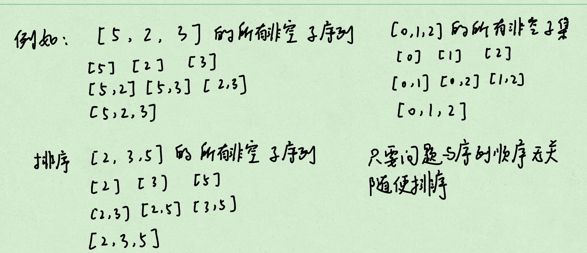

```c++
class Solution {
public:
    int numSubseq(vector<int>& nums, int target) {
        sort(nums.begin(), nums.end());
        int n = nums.size(), mod = 1e9 + 7, res = 0;
        vector<int> p(n); // p[i] = 2**i
        p[0] = 1;
        for (int i = 1; i < n; ++i) p[i] = (p[i - 1] * 2) % mod;
        // 双指针
        for (int i = 0, j = n - 1; i < n; ++i) {
            // 找到使 [j]+[i]<=target的最右边的j
            while (j >= i && nums[j] + nums[i] > target) j--;
            if (j >= i) res = (res + p[j - i]) % mod;
        }
        return res;
    }
};
```

### [满足不等式的最大值](https://leetcode.cn/problems/max-value-of-equation/)

> 对于包含两个变量 i<ji<j*i*<*j* 的优化式
>
> 可枚举 jj*j* ，寻找最优的 ii*i*
>
> 在这一过程中维护可能成为决策点的 ii*i*
>
> 若该解关于一个量存在单调性
>
> 则可使用一个栈维护，每次更新只需在末尾删除或插入，这就是所谓的单调栈
>
> 若该解存在合法性约束，但保证所有解依次失效，则只需在首部删除，这就是所谓的单调队列

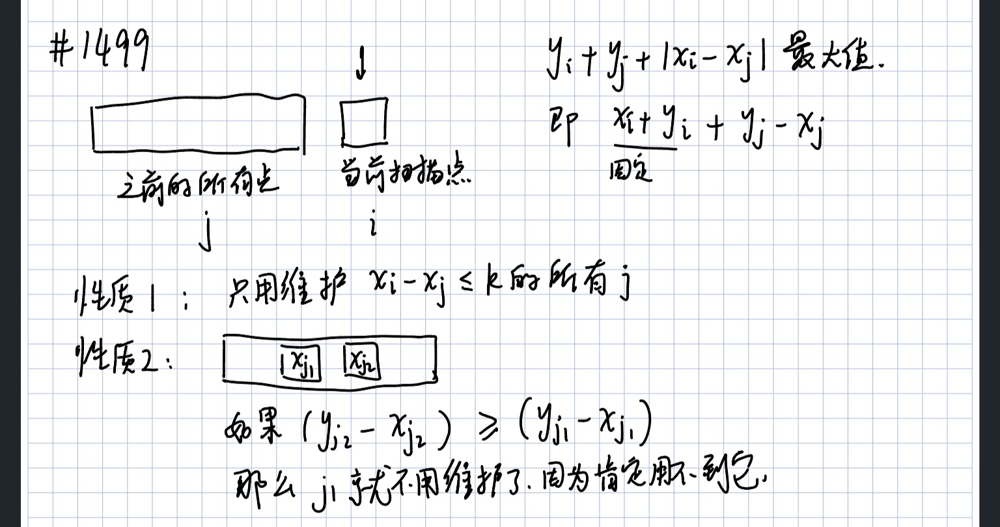

```c++
class Solution {
public:
    int findMaxValueOfEquation(vector<vector<int>>& points, int k) {
        deque<int> q;
        int res = INT_MIN, n = points.size();

        for (int i = 0; i < n; ++i) {
            int x = points[i][0], y = points[i][1];
            while (q.size() && x - points[q.front()][0] > k) q.pop_front();
            if (q.size()) {
                auto t = q.front();
                res = max(res, x + y + points[t][1] - points[t][0]);
            }
            while (q.size() && points[q.back()][1] - points[q.back()][0] <= y - x) q.pop_back();
            q.push_back(i);
        }

        return res;
    }
};
```


## 第22场双周赛

### [两个数组间的距离值](https://leetcode.cn/problems/find-the-distance-value-between-two-arrays/)

```c++
class Solution {
public:
    int findTheDistanceValue(vector<int>& arr1, vector<int>& arr2, int d) {
        int res = 0, i, j;
        for (i = 0; i < arr1.size(); ++i) {
            for (j = 0; j < arr2.size(); ++j) {
                if (abs(arr1[i] - arr2[j]) <= d) break;
            }
            if (j == (int)arr2.size()) res++;
        }
        return res;
    }
};
```

### [安排电影院座位](https://leetcode.cn/problems/cinema-seat-allocation/)

## 第223场周赛

### [解码异或后的数组](https://leetcode.cn/contest/weekly-contest-223/problems/decode-xored-array/)

```c++
class Solution {
public:
    vector<int> decode(vector<int>& encoded, int first) {
        // a[i] ^ a[i + 1] = e[i]
        // a[i + 1] = e[i] ^ a[i]
        // a[0] = first
        vector<int> a{first};
        for (auto e: encoded) {
            a.push_back(a.back() ^ e);
        }
        return a;
    }
};
```

### [交换链表中的节点](https://leetcode.cn/contest/weekly-contest-223/problems/swapping-nodes-in-a-linked-list/)

```c++
/**
 * Definition for singly-linked list.
 * struct ListNode {
 *     int val;
 *     ListNode *next;
 *     ListNode() : val(0), next(nullptr) {}
 *     ListNode(int x) : val(x), next(nullptr) {}
 *     ListNode(int x, ListNode *next) : val(x), next(next) {}
 * };
 */
class Solution {
public:
    ListNode* swapNodes(ListNode* head, int k) {
        auto dummy = new ListNode(-1, head);
        auto p = dummy, q = dummy;
        for (int i = 0; i < k; ++i) q = q->next;
        auto kth = q;
        // p [0]   q[k]
        // p[n - k + 1]    q[n + 1]
        while (q) {
            p = p->next;
            q = q->next;
        }
        auto rkth = p;
        swap(kth->val, rkth->val);
        return head;
    }
};
```

### [执行交换操作后的最小汉明距离](https://leetcode.cn/contest/weekly-contest-223/problems/minimize-hamming-distance-after-swap-operations/)

```c++
class Solution {
    /*
        并查集
    */
public:
    vector<int> p; // 并查集
    int find(int x) {
        if (p[x] != x) p[x] = find(p[x]);
        return p[x];
    }
    int minimumHammingDistance(vector<int>& source, vector<int>& target, vector<vector<int>>& allowedSwaps) {
        int n = source.size();
        // 分成若干个连通集
        for (int i = 0; i < n; ++i) p.push_back(i);
        for (auto as: allowedSwaps) {
            p[find(as[0])] = find(as[1]);
        }
        // 从并查集中取出集合
        vector<unordered_multiset<int>> hash(n); // 因为可能有重复元素，所以用multiset
        for (int i = 0; i < n; i ++ ) hash[find(i)].insert(source[i]);
        int res = 0;
        for (int i = 0; i < n; i ++ ) {
            auto& h = hash[find(i)];
            if (h.count(target[i])) h.erase(h.find(target[i]));
            else res ++ ;
        }
        return res;
    }
};
```


98

## 第 34 场双周赛

### [矩阵对角线元素的和](https://leetcode.cn/problems/matrix-diagonal-sum/)


## 第 280 场周赛

### [得到 0 的操作数](https://leetcode.cn/problems/count-operations-to-obtain-zero/)

辗转相除法

```c++
// O(n) 
class Solution { 
public:
    int countOperations(int num1, int num2) {
        if (num1 < num2) swap(num1, num2);
        if (num2 == 0) return 0;
        return countOperations(num1 - num2, num2) + 1;
    }
};
```

```c++
// O(log n)
class Solution {
public:
    int countOperations(int num1, int num2) {
        int res = 0;   // 相减操作的总次数
        while (num1 && num2) {
            // 每一步辗转相除操作
            res += num1 / num2;
            num1 %= num2;
            swap(num1, num2);
        }
        return res;
    }
};
```


复杂度推导：

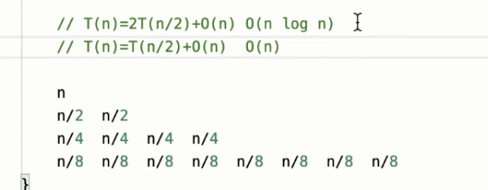

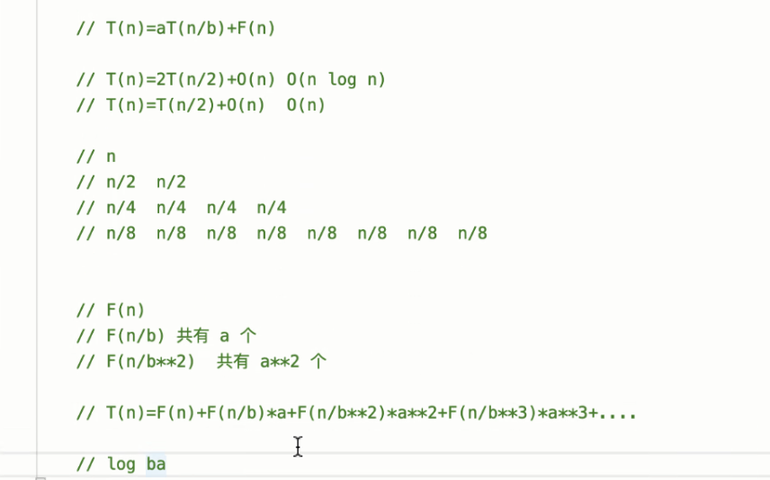

### [使数组变成交替数组的最少操作数](https://leetcode.cn/problems/minimum-operations-to-make-the-array-alternating/)

参数化：a和b构成了问题求解的重要元素。对于一个缺乏明确优化目标的优化问题，应构建模型并设计其参数，将问题转化为对最优参数的求解

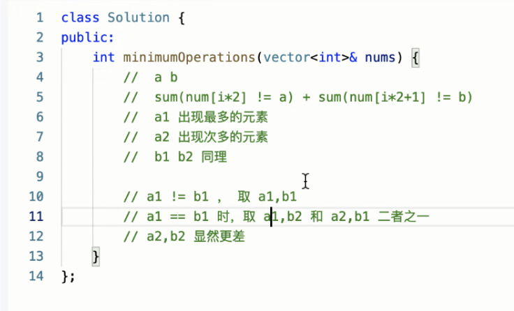

```c++
class Solution {
public: 
    const int N = 100010;
    int minimumOperations(vector<int>& nums) {
        int a1, a2, b1, b2;
        int odd = nums.size() / 2;
        int even = nums.size() - odd;
        vector<int> freq_a(N), freq_b(N);
        for (int i = 0, n = nums.size(); i < n; ++i) {
            if (i & 1) freq_b[nums[i]]++;
            else freq_a[nums[i]]++;
        }
        a1 = max_element(freq_a.begin(), freq_a.end()) - freq_a.begin();
        int a1_f = freq_a[a1];
        freq_a[a1] = 0;
        a2 = max_element(freq_a.begin(), freq_a.end()) - freq_a.begin();
        int a2_f = freq_a[a2];
        b1 = max_element(freq_b.begin(), freq_b.end()) - freq_b.begin();
        int b1_f = freq_b[b1];
        freq_b[b1] = 0;
        b2 = max_element(freq_b.begin(), freq_b.end()) - freq_b.begin();
        int b2_f = freq_b[b2];

        if (a1 != b1) return even - a1_f + odd - b1_f;
        else {
            return min(even - a2_f + odd - b1_f, even - a1_f + odd - b2_f);
        }

    }
};
```


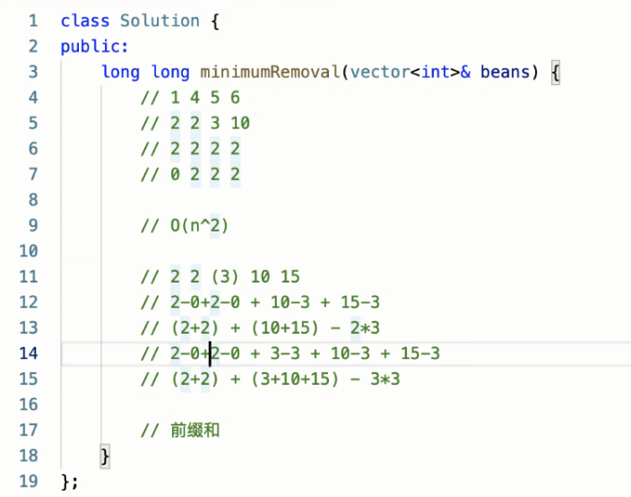

找到题眼

状态压缩dp

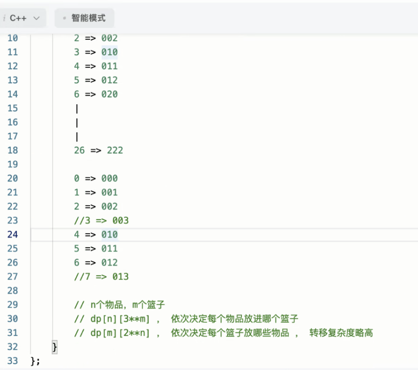


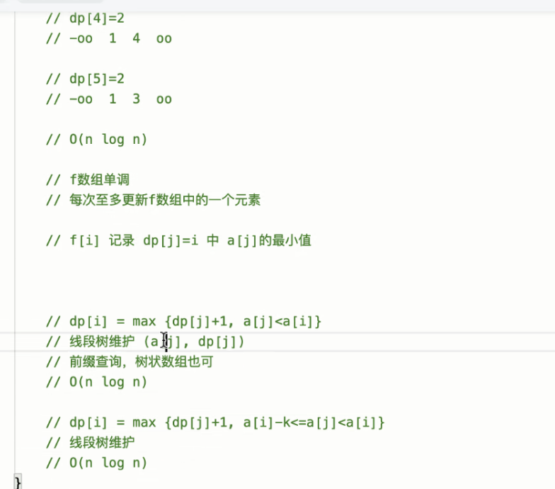

# 剑指 Offer II

## [剑指 Offer II 059. 数据流的第 K 大数值](https://leetcode.cn/problems/jBjn9C/)

维护一个大小为k的、存有最大的k个数的小顶堆即可。

```c++
class KthLargest {
    priority_queue<int, vector<int>, greater<int>> heap;
    int k;
public:
    KthLargest(int k, vector<int>& nums) {
        this->k = k;
        for (auto n: nums) add(n);
    }
    
    int add(int val) {
        heap.push(val);
        if (heap.size() > k) heap.pop();
        return heap.top();
    }
};

/**
 * Your KthLargest object will be instantiated and called as such:
 * KthLargest* obj = new KthLargest(k, nums);
 * int param_1 = obj->add(val);
 */
```

## [剑指 Offer 40. 最小的k个数](https://leetcode.cn/problems/zui-xiao-de-kge-shu-lcof/)

https://www.acwing.com/activity/content/problem/content/820/


# 搜索

### [100. 相同的树](https://leetcode.cn/problems/same-tree/)

```c++
class Solution {
public:
    bool isSameTree(TreeNode* p, TreeNode* q) {
        if (!p && !q) return true;
        if (!p || !q) return false;
        if (p->val != q->val) return false;
        return isSameTree(p->left, q->left) && isSameTree(p->right, q->right);
    }
};
```


# 其他

### [6. Z 字形变换](https://leetcode.cn/problems/zigzag-conversion/)

```c++
// 我写的
class Solution {
public:
    string convert(string s, int numRows) {
        if (numRows == 1) return s;
        vector<string> res(numRows);
        for (int i = 0; i < s.size(); i++) {
            int idx = i % (2 * numRows - 2);
            if (idx <= numRows - 1) res[idx] += s[i];
            else res[2 * numRows - 2 - idx] += s[i];
        }
        string ans;
        for (auto str: res) ans += str;
        return ans;
    }
};
```

```c++
// 题解写的
class Solution {
public:
    string convert(string s, int numRows) {
        if (numRows == 1) return s;
        vector<string> rows(numRows);
        // 行转向标志，极妙
        int flag = 1;  
        // 行下标索引
        int idxRows = 0;   
        for (int i = 0; i < s.size(); i++) {
            rows[idxRows].push_back(s[i]);
            // 更新行下标
            idxRows += flag;  
            if (idxRows == numRows - 1 || idxRows == 0) {
                // 转向，上——>下 | 下——>上
                flag = -flag;
            }
        }
        string res;
        for (auto row : rows) {
            // 拿到答案
            res += row;
        }
        return res;
    }
};
```

### [367. 有效的完全平方数](https://leetcode.cn/problems/valid-perfect-square/)
