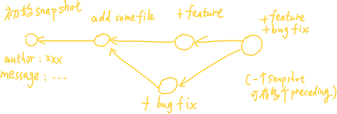

# Version Control (git)

2023-01-13


## Git's data model

### Snapshots

Git 将顶级目录中的文件和文件夹作为集合，并通过一系列 **snapshot** 来管理其历史记录。文件被称作 blob，目录被称作 tree，snapshot 则是被追踪的最顶层的 tree。例如：

```
<root> (tree, top folder, where snapshot is tracked)
|
+- foo (tree)
|  |
|  + bar.txt (blob, contents = "hello world")
|
+- baz.txt (blob, contents = "git is wonderful")
```

### Model history

最简单：线性历史记录，按时间顺序排列。但 Git 没有采用这种模型。在 Git 中，历史记录是一个由 snapshot 组成的有向无环图 ( directed acyclic graph, DAG )。



### Data model as pseudocode

```py
type blob = array<byte>

type tree = map<string, tree | blob>

type commit = struct {
		parent: array<commit>
		author: string
		commit_message: string
		snapshot: tree
}
```

### Objects are content-addressed by hash

```py
type object = blob | tree | commit

type objects = map<string, object>

def store(object):
		id = SHA1(object)
		objects[id] = object
	
def load(id):
		return objects[id]
```

We can get the information about an object by using `git cat-file -p <sha1 hash>`, take the root folder above for example:

```
100644 blob 4448adbf7ecd394f42ae135bbeed9676e894af85    baz.txt
040000 tree c68d233a33c5c06e0340e4c224f0afca87c8ce87    foo
```

Then we get anothor two pointers, `baz.txt` (a blob) and `foo` (a tree). use `git cat-file -p 4448adbf7ecd394f42ae135bbeed9676e894af85`, we will get the content in `baz.txt`

### References

40-characters hash is inconvenient, we can give human-readable names for SHA1 hashes, which is called "references".

references are mutable (can be updated to point to a new commit). 

```py
references = map<string, string>
# reference name --> sha1 hash

def update_reference(name, id):
		references[name] = id

def read_reference(name):
		return references[name]

def load_reference(name_or_id):
		if name_of_id in references:
				return load(references[name_or_id])
    else:
        return load(name_or_id)
```


