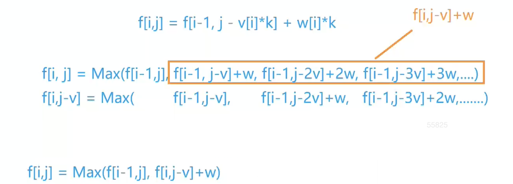

# 第一讲 基础算法

## 快速排序

## 归并排序

## 二分

本质其实不是单调性，而是一个序列，一部分具有某个性质，另一部分不具有，我们就可以二分出这个边界。


### 整数二分

二分的本质：

找到一个性质使序列一分为二，一半满足这个性质，一半不满足这个性质。那么二分查找可以求得左区间的右端点，和右区间的左端点。

$$[l, ...,red, green, ..., r]$$

$[l, red]$是红色区间，red代表其右端点；$[green, r]$是绿色区间，green代表其左端点。

二分查找可以在$log(n)$时间内找到red或green

**一、找red**

`mid = ?`

`if(check(mid))`  说明mid此时落在红色区间内，则查找区间缩小为$[mid, r]$

`else` 说明mid此时落在绿色区间内，则查找区间缩小为$[l, mid-1]$

**二、找green**

`mid = ?`

`if(check(mid))` 说明mid此时落在绿色区间内，则查找区间缩小为$[l, mid]$

`else` 说明mid此时落在红色区间内，则查找区间缩小为$[mid + 1, r]$

---

问题在于这两个问号，只是简单地取`mid=l+r>>1`就可以了吗？

这是经典的边界问题，在快排模板里也出现过。第一种情况里，$[l, r] \rArr [mid, r]$，则mid不能取到$l$，否则会陷入死循环。同理，第二种情况$mid$不能取到$r$。


综上，第一个问号`mid = l + r + 1 >> 1`， 第二个问号`mid = l + r >> 1`

```c++

bool check(int x) {/* ... */} // 检查x是否满足某种性质

// 区间[l, r]被划分成[l, mid]和[mid + 1, r]时使用：
// 对应上图绿色
int bsearch_1(int l, int r)
{
    while (l < r)
    {
        int mid = l + r >> 1;
        if (check(mid)) r = mid;    // check()判断mid是否满足性质
        else l = mid + 1;
    }
    return l;
}
// 区间[l, r]被划分成[l, mid - 1]和[mid, r]时使用：
int bsearch_2(int l, int r)
{
    while (l < r)
    {
        int mid = l + r + 1 >> 1;
        if (check(mid)) l = mid;
        else r = mid - 1;
    }
    return l;
}
```


## 高精度

## 前缀和与差分

## 双指针算法

本质是找到某种单调性。

```c++
for (int i = 0, j = 0; i < n; i ++ )
{
    while (j < i && check(i, j)) j ++ ;

    // 具体问题的逻辑，如何更新非遍历的那个指针
}
常见问题分类：
    (1) 对于一个序列，用两个指针维护一段区间
    (2) 对于两个序列，维护某种次序，比如归并排序中合并两个有序序列的操作
核心思想：优化暴力枚举，减少一层循环
```

基础用法举例：分割单词，但是没有应用单调性。

```c++
int main() {
  char str[100];
  gets(str);
  int n = strlen(str);
  for (int i = 0; i < n; ++i) {
    int j = i;
    while (j < n && str[j] != ' ') j++;
    for (int k = i; k < j; ++k) cout << str[k];
    cout << endl;
    i = j;
  }
  return 0;
}
```

经典用法：最长不重复的连续子序列

单调性：j往右走，i不可能往左走。

```c++
const int N = 100010;
int a[N];
int cnt[N];
int main() {
  int n;
  cin >> n;
  int res = 0;
  for (int i = 0; i < n; ++i) cin >> a[i];
  for (int i = 0, j = 0; i < n; ++i) {
    cnt[i] += 1;
    while (cnt[i] > 1) cnt[j++] -= 1;
    res = max(res, i - j + 1);
  }
  cout << res << endl;
}
```


## 位运算

## 离散化

## 区间合并

# 第二讲 数据结构

## 单链表

最好用一个dummy，虚拟头结点，防止边界情况讨论。

```c++
// head存储链表头，e[]存储节点的值，ne[]存储节点的next指针，idx表示当前用到了哪个节点
int head, e[N], ne[N], idx;

// 初始化
void init()
{
    head = -1; // head -> ∅
    idx = 0;
}

// 在链表头插入一个数a
void insert(int a)
{
    e[idx] = a, ne[idx] = head, head = idx ++ ;
}

// 将头结点删除，需要保证头结点存在
void remove()
{
    head = ne[head];
}
```

### [AcWing 826. 单链表](https://www.acwing.com/problem/content/828/)

```c++
#include <algorithm>
#include <cstdio>
#include <cstring>
#include <iostream>
#include <string>
#include <vector>
using namespace std;

const int maxn = 100010;
int e[maxn], ne[maxn], head, idx;
// 每个下标对应一个结点。 head维护头结点的下标。

void init() { head = -1; }

// 在下标为k的结点右边插入新结点
void insert(int k, int x) {
  e[idx] = x;
  ne[idx] = ne[k];
  ne[k] = idx++;
}

// 删除下标为k的结点的右边那个结点
void remove(int k) { ne[k] = ne[ne[k]]; }

// 添加新结点为头结点
void newhead(int x) {
  e[idx] = x;
  ne[idx] = head;
  head = idx++;
}

int main() {
  int n;
  cin >> n;
  init();
  while (n--) {
    int k, x;
    char op[2];
    cin >> op;
    if (*op == 'H') {
      cin >> x;
      newhead(x);
    } else if (*op == 'D') {
      cin >> k;
      if (k)
        remove(k - 1);
      else
        head = ne[head];
    } else {
      cin >> k >> x;
      insert(k - 1, x);
    }
  }
  for (int i = head; i != -1; i = ne[i]) cout << e[i] << " ";
  cout << endl;
}
```


## 双链表

```c++
// e[]表示节点的值，l[]表示节点的左指针，r[]表示节点的右指针，idx表示当前用到了哪个节点
int e[N], l[N], r[N], idx;

// 初始化
void init()
{
    //0是左端点，1是右端点，相当于虚拟头/尾节点
    r[0] = 1, l[1] = 0;
    idx = 2;
}

// 在节点a的右边插入一个数x
void insert(int a, int x)
{
    e[idx] = x;
    l[idx] = a, r[idx] = r[a];
    l[r[a]] = idx, r[a] = idx ++ ;
}

// 删除节点a
void remove(int a)
{
    l[r[a]] = l[a];
    r[l[a]] = r[a];
}
```


## 栈

模板

```c++
// tt表示栈顶
int stk[N], tt = 0;

// 向栈顶插入一个数
stk[ ++ tt] = x;

// 从栈顶弹出一个数
tt -- ;

// 栈顶的值
stk[tt];

// 判断栈是否为空
if (tt > 0)
{

}
```


### [AcWing 3302. 表达式求值](https://www.acwing.com/activity/content/problem/content/3648/)

```c++
#include <algorithm>
#include <cstdio>
#include <cstring>
#include <iostream>
#include <stack>
#include <string>
#include <unordered_map>
#include <vector>
using namespace std;

/** 表达式求值
 *
 * 先不考虑括号和优先级，那么从左到右做即可。但考虑括号和优先级的话，有可能先做右边的运算，再做
 * 左边的运算。本题核心就是如何确定运算的先后顺序。
 *
 * 不考虑括号，因为有括号的情况其实是一个子问题。
 * num1 op1 num2 op2 num3 op3....
 * 从左往右扫描，遇到op1时，能直接算吗？不能，例如1+1*2。因此先将op1存起来，继续扫描
 * 遇到op2，此时op2同理不能直接算，要存起来。而此时的op1可以直接算了吗？有可能。当op1的优先级
 * 大于等于op2的优先级时，可以直接算出op1的值，减小问题规模。而op1优先级小于op2呢？此时只有等
 * op2算完了才能算op1，也就是说这一段运算顺序变成了从右往左。这时我们想到，可以用栈来模拟整个
 * 过程。可以看出，栈中的op的优先级一定是严格递增的，否则可以直接计算前缀了。没有新的op入栈时，
 * 依次出栈并计算即可。
 */

unordered_map<char, int> pri{{'+', 1}, {'-', 1}, {'*', 2}, {'/', 2}};
stack<int> nums;
stack<char> op;

/**
 * @brief 取出栈顶的 num op num 运算
 */
void eval() {
    auto b = nums.top();
    nums.pop();
    auto a = nums.top();
    nums.pop();
    auto o = op.top();
    op.pop();
    int res;
    if (o == '+')
        res = a + b;
    else if (o == '-')
        res = a - b;
    else if (o == '*')
        res = a * b;
    else
        res = a / b;
    nums.push(res);
}

int main() {
    string exp;
    cin >> exp;
    for (int i = 0, n = exp.size(); i < n; ++i) {
        if (isdigit(exp[i])) {  // 把数字取出来
            int num = 0, j;
            for (j = i; isdigit(exp[j]); ++j) num = num * 10 + (exp[j] - '0');
            i = j - 1;
            nums.push(num);
        } else {
            if (exp[i] == '(')
                op.push('(');
            else if (exp[i] == ')') {  // 取出括号之间的子表达式计算出值放入nums
                while (op.top() != '(') eval();  // 从右往左算
                op.pop();                        // 左括号出栈
            } else {
                // 有点类似单调栈
                while (op.size() && pri[exp[i]] <= pri[op.top()]) eval();
                // ^这里有个细节是当op栈顶是(时，pri对应0，条件必定为假。
                op.push(exp[i]);  // 运算符入栈
            }
        }
    }
    while (op.size()) eval();  // 从右往左计算
    cout << nums.top() << endl;
    // while(nums.size()){ cout << nums.top() << endl; nums.pop();}
    // while(op.size()){ cout << op.top() << endl; op.pop();}
    return 0;
}
```


## 队列

普通队列：和 STL queue 不同。手写队列队尾也可以删除元素。但是不是双端队列，因为队头不能插入元素。

```c++
// hh 表示队头，tt表示队尾
int q[N], hh = 0, tt = -1;

// 向队尾插入一个数
q[ ++ tt] = x;

// 从队头弹出一个数
hh ++ ;

// 队头的值
q[hh];

// 判断队列是否为空
if (hh <= tt)
{

}
```

循环队列：N 要大于队列中可能存在的最大数量

```c++
// hh 表示队头，tt表示队尾的后一个位置
int q[N], hh = 0, tt = 0; 


// 向队尾插入一个数
q[tt ++ ] = x;
if (tt == N) tt = 0;

// 从队头弹出一个数
hh ++ ;
if (hh == N) hh = 0;

// 队头的值
q[hh];

// 判断队列是否为空
if (hh != tt)
{

}
```


## 单调栈

```c++
常见模型：找出每个数左边离它最近的比它大/小的数
int tt = 0;
for (int i = 1; i <= n; i ++ )
{
    while (tt && check(stk[tt], i)) tt -- ;
    stk[ ++ tt] = i;
}
```


常见模型：给定一个序列，对序列中的每一个数，求其左/右边离它最近的比它大/小的数。

```
3	  4	 2	7	 5
-1  3 -1  2  2
```

>  考虑方式和双指针类似，先想一下暴力做法是什么，然后再挖掘一些性质，使得我们可以把目光集中到比较少的状态里面，从而把问题的时间复杂度降低。

暴力做法：

```c++
for i 0 ~ n-1
  	for j  i-1 ~ 0
      	if ai > aj 
         		get aj
          	break;
```

如何优化？首先可以用一个栈存放 i 左边所有的数。


```c++
// 栈里面始终存了所有可能是答案的数
int main() {
    int n, cur, i;
    cin >> n;
    stack<int> stk;
    for (i = 0; i < n; ++i) {
        cin >> cur;
        while (stk.size() && stk.top() >= cur) stk.pop();
        if (stk.empty())
            cout << "-1 ";
        else
            cout << stk.top() << " ";
        stk.push(cur);
    }
    cout << endl;
    return 0;
}
```


## 单调队列

```c++
常见模型：找出滑动窗口中的最大值/最小值
int hh = 0, tt = -1;
for (int i = 0; i < n; i ++ )
{
    while (hh <= tt && check_out(q[hh])) hh ++ ;  // 判断队头是否滑出窗口
    while (hh <= tt && check(q[tt], i)) tt -- ;
    q[ ++ tt] = i;
}
```

### [AcWing 154. 滑动窗口](https://www.acwing.com/problem/content/156/)

```c++
#include <algorithm>
#include <cstdio>
#include <cstring>
#include <deque>
#include <iostream>
#include <stack>
#include <string>
#include <unordered_map>
#include <vector>
using namespace std;

const int N = 1e6 + 10;
int a[N];

/*** 滑动窗口
 *
 */

int main() {
    int n, k;
    cin >> n >> k;
    for (int i = 0; i < n; ++i) cin >> a[i];
    deque<int> minq, maxq;  // 存下标，否则无法知道是否滑出窗口

    for (int i = 0; i < n; ++i) {
        // 判断队头是否滑出窗口
        while (minq.size() && minq.front() < i - k + 1) minq.pop_front();
        // 清楚队列中失效的元素，类似于单调栈
        while (minq.size() && a[minq.back()] >= a[i]) minq.pop_back();
        minq.push_back(i);  // 每个元素都入队一次
        if (i >= k - 1) cout << a[minq.front()] << " ";  // 根据题目特殊化
    }
    cout << endl;
    for (int i = 0; i < n; ++i) {
        while (maxq.size() && maxq.front() < i - k + 1) maxq.pop_front();
        while (maxq.size() && a[maxq.back()] <= a[i]) maxq.pop_back();
        maxq.push_back(i);
        if (i >= k - 1) cout << a[maxq.front()] << " ";
    }
    cout << endl;
}
```


## KMP


## Trie

## 并查集

>  面试非常喜欢考，思路精巧，代码很短。 ——yxc

### 基本的操作

1. 将两个集合合并
2. 询问两个元素是否在同一个集合当中

先想一下，暴力怎么支持这两个操作？

```c++
belong[x] = a // 元素x的属于集合a
if (belong[x] == belong[y]) ... // 元素x和y属于同一个集合
// 这种情况下，如何合并呢？
假如集合a有1000个元素，集合b有2000个元素，合并这两个集合至少需要1000次操作（将a中元素的belong都修改成b），复杂度爆炸
```

而并查集可以在近乎 O(1) 的时间复杂度内支持这两个操作

### 基本原理

用树的形式维护所有集合（不一定是二叉树），根节点是当前集合的代表元素，也就是说，集合的标识符就是根节点的编号。每个节点还要额外存储它的父节点。


```c++
x为每个节点的编号，p[x]为x的父节点的编号

问题1：如何判断树根？ if(p[x] == x) ...
问题2：如何求x的集合的编号？ while(p[x] != x) x = p[x]; (*)
问题3：如何合并两个集合？ px是x的集合编号，py是y的集合编号： p[px] = py;

但是这样的复杂度还是很高，主要是(*)操作很费时。如何优化？ /*路径压缩*/
from  root <-- x1 <-- x2 <-- x3 
to    root <-- x1
  		root <-- x2
  		root <-- x3
```

### [AcWing 836. 合并集合](https://www.acwing.com/activity/content/problem/content/885/)

```c++
#include <iostream>

using namespace std;

const int N = 100010;

int p[N];

int find(int x)
{
    if (p[x] != x) p[x] = find(p[x]);
    return p[x];
}

int main()
{
    int n, m;
    scanf("%d%d", &n, &m);
    for (int i = 1; i <= n; i ++ ) p[i] = i;

    while (m -- )
    {
        char op[2];
        int a, b;
        scanf("%s%d%d", op, &a, &b);
        if (*op == 'M') p[find(a)] = find(b);
        else
        {
            if (find(a) == find(b)) puts("Yes");
            else puts("No");
        }
    }
    return 0;
}
```


## 堆

## 哈希表

# 第三讲 搜索与图论

## DFS

### [AcWing 842. 排列数字](https://www.acwing.com/activity/content/problem/content/905/)


### [AcWing 843. n-皇后问题](https://www.acwing.com/activity/content/problem/content/906/)

搜索顺序：一行一行地搜（每行至多一个）

## BFS

### [AcWing 844. 走迷宫](https://www.acwing.com/activity/content/problem/content/907/)

对于边权为1的图，可用BFS求最短路。


```c++

```

## 树与图的存储


无向图看成是特殊的有向图，每条无向边看成方向不同的两条有向边。

### 邻接矩阵

g\[a][b] 存储边a->b

### 邻接表

```c++
// 对于每个点k，开一个单链表，存储k所有可以走到的点。h[k]存储这个单链表的头结点
int h[N], e[N], ne[N], idx;

// 添加一条边a->b
void add(int a, int b)
{
    e[idx] = b, ne[idx] = h[a], h[a] = idx++ ;
}

// 初始化
idx = 0;
memset(h, -1, sizeof h);
```


## 树与图的深度优先遍历

### [AcWing 846. 树的重心](https://www.acwing.com/activity/content/problem/content/909/)

## 树与图的广度优先遍历

### [AcWing 847. 图中点的层次](https://www.acwing.com/activity/content/problem/content/910/)

## 拓扑排序

## Dijkstra

## bellman-ford

## spfa

## Floyd

## Prim

## Kruskal

## 染色法判定二分图

## 匈牙利算法

# 第四讲 数学知识

## 质数

## 约数

## 欧拉函数

## 快速幂

## 扩展欧几里得算法

## 中国剩余定理

## 高斯消元

## 求组合数

## 容斥原理

## 博弈论

# 第五讲 动态规划

## 背包问题

### [AcWing 2. 01背包问题](https://www.acwing.com/activity/content/problem/content/997/)

暴力做法：每件物品选或者不选，搜索空间 2^n^ ，超过最大体积则剪枝。

```c++
#include <iostream>
#include <cstring>
#include <algorithm>
using namespace std;

const int N = 1010;
int v[N], w[N], n, m;
int cur_v, cur_w;
int res;

void dfs(int u) {
    // cout << u << " " << cur_v << " " << cur_w << endl;
    if (u == n + 1) {
        if (cur_v <= m) res = max(res, cur_w);
        return;
    }
    for (int i = 0; i <= 1; ++i) { // 对第u个物品，0不选，1选
        cur_v += i * v[u];
        cur_w += i * w[u];
        dfs(u + 1);
        cur_v -= i * v[u];
        cur_w -= i * w[u];
    }
}

int main()
{
    cin >> n >> m;
    for (int i = 1; i <= n; ++i) cin >> v[i] >> w[i];
    dfs(1);
    cout << res << endl;
}

```

但是实际上不用单独考虑每个状态（搜索树里的节点），而是可以将所有节点划分为很多个集合，每个集合考虑里面的最大值即可，而这些集合之间有拓扑序，可以使用动态规划。


《不重不漏》

i 和 j 都有拓扑序。第一维一定要按拓扑序，第二维无所谓。（可以尝试修改 i j 位置或顺序试验）。

```c++
#include <iostream>
#include <cstring>
#include <algorithm>

using namespace std;

const int N = 1010;
int v[N], w[N];
int n, m;
int dp[N][N];

int main() {
    cin >> n >> m;
    for (int i = 1; i <= n; ++i) cin >> v[i] >> w[i];
    for (int i = 1; i <= n; ++i)
        for (int j = 1; j <= m; ++j) {
            dp[i][j] = dp[i - 1][j]; // 不选物品i
            if (j >= v[i]) dp[i][j] = max(dp[i][j], dp[i - 1][j - v[i]] + w[i]);
        }
        
    cout << dp[n][m] << endl;
}
```

滚动数据压缩：n 行 → 1行。

```c++
#include <iostream>
#include <cstring>
#include <algorithm>

using namespace std;

const int N = 1010;
int v[N], w[N];
int n, m;
int dp[N];

int main() {
    cin >> n >> m;
    for (int i = 1; i <= n; ++i) cin >> v[i] >> w[i];
    for (int i = 1; i <= n; ++i)
        for (int j = m; j >= v[i]; --j) {
            dp[j] = max(dp[j], dp[j - v[i]] + w[i]); 
        }
        
    cout << dp[m] << endl;
}
```

### [AcWing 3. 完全背包问题](https://www.acwing.com/activity/content/problem/content/998/)




```c++
#include <iostream>
#include <cstring>
#include <algorithm>
using namespace std;

const int N = 1010;
int n, m, v[N], w[N], f[N][N];

int main() {
    cin >> n >> m;
    for (int i = 1; i <= n; ++i) cin >> v[i] >> w[i];
    for (int i = 1; i <= n; ++i) {
        for (int j = 1; j <= m; ++j) {
            f[i][j] = f[i - 1][j]; // 不选i
            if (j >= v[i]) f[i][j] = max(f[i][j], f[i][j - v[i]] + w[i]);
        }
    }
    cout << f[n][m] << endl;
}
```

```c++
#include <iostream>
#include <cstring>
#include <algorithm>
using namespace std;

const int N = 1010;
int n, m, v[N], w[N], f[N];

int main() {
    cin >> n >> m;
    for (int i = 1; i <= n; ++i) cin >> v[i] >> w[i];
    for (int i = 1; i <= n; ++i) {
        for (int j = v[i]; j <= m; ++j) {
            f[j] = max(f[j], f[j - v[i]] + w[i]);
        }
    }
    cout << f[m] << endl;
}
```

### [AcWing 4. 多重背包问题](https://www.acwing.com/activity/content/problem/content/999/)

复杂度：O(NVS)

```c++
#include <iostream>
#include <cstring>
#include <algorithm>
using namespace std;

const int N =  110;
int n, m, v[N], w[N], s[N], f[N][N];

// f[i][j] = max(f[i - 1][j - k * v[i]] + k * w[i]); k = 0, 1, ..., s[i] && k * v[i] <= j

int main() {
    cin >> n >> m;
    for (int i = 1; i <= n; ++i) cin >> v[i] >> w[i] >> s[i];
    for (int i = 1; i <= n; ++i) {
        for (int j = 1; j <= m; ++j) {
            for (int k = 0; k <= s[i] && k * v[i] <= j; ++k) {
                f[i][j] = max(f[i][j], f[i - 1][j - k * v[i]] + k * w[i]);
            }
        }
    }
    cout << f[n][m] << endl;
}
```

拆成01背包  复杂度：O(NVS)

```c++
#include <iostream>
#include <cstring>
#include <algorithm>
using namespace std;

const int N =  110;
int n, m, v[N * N], w[N * N], f[N * N][N];

// f[i][j] = max(f[i - 1][j - k * v[i]] + k * w[i]); k = 0, 1, ..., s[i] && k * v[i] <= j

int main() {
    cin >> n >> m;
    int cnt = 0;
    for (int i = 1; i <= n; ++i) {
        int a, b, s;
        cin >> a >> b >> s;
        while(s--) {
            v[++cnt] = a;
            w[cnt] = b;
        }
    }
    for (int i = 1; i <= cnt; ++i) {
        for (int j = 1; j <= m; ++j) {
            f[i][j] = f[i - 1][j];
            if (j >= v[i]) f[i][j] = max(f[i][j], f[i - 1][j - v[i]] + w[i]);
        }
    }
    cout << f[cnt][m] << endl;
}
```

复杂度O(NVlogS) 二进制优化，对拆分的01背包预打包

### [AcWing 5. 多重背包问题 II](https://www.acwing.com/activity/content/problem/content/1000/)

```c++
#include <iostream>
#include <cstring>
#include <algorithm>
using namespace std;

const int N = 15010; // 对每一种物品打包成floor(log(s+1))个
int n, m, v[N], w[N], f[N];

int main() {
    cin >> n >> m;
    int cnt = 0;
    for (int i = 1; i <= n; ++i) {
        int a, b, s;
        cin >> a >> b >> s;
        for (int k = 1; k <= s; k *= 2) { // 大小为k的打包
            v[++cnt] = k * a;
            w[cnt] = k * b;
            s -= k;
        }
        if (s > 0) {
            v[++cnt] = s * a;
            w[cnt] = s * b;
        }
    }
    // 01背包模板
    for (int i = 1; i <= cnt; ++i) {
        for (int j = m; j >= v[i]; --j) {
            f[j] = max(f[j], f[j - v[i]] + w[i]);
        }
    }
    
    cout << f[m] << endl;
    
}
```


### [AcWing 9. 分组背包问题](https://www.acwing.com/activity/content/problem/content/1001/)


```c++
#include <iostream>
#include <cstring>
#include <algorithm>
using namespace std;
const int N = 110;
int v[N][N], w[N][N], s[N], n, m, f[N][N];

int main() {
    cin >> n >> m;
    for (int i = 1; i <= n; ++i) {
        cin >> s[i];
        for (int j = 1; j <= s[i]; ++j) {
            cin >> v[i][j] >> w[i][j];
        }
    }
    
    for (int i = 1; i <= n; ++i) {
        for (int j = 1; j <= m; ++j) {
            for (int k = 0; k <= s[i]; ++k) {
                if (j >= v[i][k]) f[i][j] = max(f[i][j], f[i - 1][j - v[i][k]] + w[i][k]);
            }
        }
    }
    cout << f[n][m] << endl;
}
```

```c++
#include <iostream>
#include <cstring>
#include <algorithm>
using namespace std;
const int N = 110;
int v[N][N], w[N][N], s[N], n, m, f[N];

int main() {
    cin >> n >> m;
    for (int i = 1; i <= n; ++i) {
        cin >> s[i];
        for (int j = 1; j <= s[i]; ++j) {
            cin >> v[i][j] >> w[i][j];
        }
    }
    
    for (int i = 1; i <= n; ++i) {
        for (int j = m; j >= 1; --j) {
            for (int k = 1; k <= s[i]; ++k) {
                if (j >= v[i][k]) f[j] = max(f[j], f[j - v[i][k]] + w[i][k]);
            }
        }
    }
    cout << f[m] << endl;
}
```


## 线性DP

### [AcWing 898. 数字三角形](https://www.acwing.com/activity/content/problem/content/1002/)

```c++
#include <iostream>
#include <cstring>
#include <algorithm>
#include <climits>
using namespace std;

const int N =  510;
int f[N][N], n;

int main() {
    cin >> n;
    cin >> f[1][1];
    for (int i = 2; i <= n; ++i) {
        for (int j = 1; j <= i; ++j) {
            // 左上角: i-1,j-1; 右上角: i-1,j
            auto check = [&] (int a, int b) -> bool {
                if (1 <= a && a <= n && 1 <= b && b <= a) return true;
                else return false;
            };
            int cur; cin >> cur;
            f[i][j] = INT_MIN;
            if (check(i - 1, j - 1)) f[i][j] = max(f[i][j], f[i - 1][j - 1]);
            if (check(i - 1, j)) f[i][j] = max(f[i][j], f[i - 1][j]);
            f[i][j] += cur;
        }
    }
    int res = INT_MIN;
    for (int i = n, j = 1; j <= n; ++j) res = max(res, f[i][j]);
    cout << res << endl;
}
```

可以用技巧缩减代码量。主要是不用判断是否出界，只要把界外的点初始化为负无穷，那么即使转移也和没转移效果一样。

```c++
#include <iostream>
#include <cstring>
#include <algorithm>
#include <climits>
using namespace std;

const int N =  510;
int f[N][N], n;

int main() {
    cin >> n;
    memset(f, 0x8f, sizeof f); // 初始化为大约-2e9
    cin >> f[1][1];
    for (int i = 2; i <= n; ++i) {
        for (int j = 1; j <= i; ++j) {
            // 左上角: i-1,j-1; 右上角: i-1,j 
            int cur; cin >> cur;
            f[i][j] = max(f[i - 1][j - 1], f[i - 1][j]);
            f[i][j] += cur;
        }
    }
    int res = INT_MIN;
    for (int i = n, j = 1; j <= n; ++j) res = max(res, f[i][j]);
    cout << res << endl;
}
```

### 	[AcWing 895. 最长上升子序列](https://www.acwing.com/activity/content/problem/content/1003/)

```c++
#include <iostream>
#include <algorithm>

using namespace std;

const int N = 1010;

int n;
int a[N], f[N];

int main()
{
    scanf("%d", &n);
    for (int i = 1; i <= n; i ++ ) scanf("%d", &a[i]);

    for (int i = 1; i <= n; i ++ )
    {
        f[i] = 1; // 只有a[i]一个数
        for (int j = 1; j < i; j ++ )
            if (a[j] < a[i])
                f[i] = max(f[i], f[j] + 1);
    }

    int res = 0;
    for (int i = 1; i <= n; i ++ ) res = max(res, f[i]);

    printf("%d\n", res);

    return 0;
}
```


### [AcWing 896. 最长上升子序列 II](https://www.acwing.com/activity/content/problem/content/1004/)

```c++
```


## 区间DP

## 计数类DP ✅ 

### [AcWing 900. 整数划分](https://www.acwing.com/activity/content/problem/content/1008/)

O(n^2^) 的解法

完全背包

状态表示：
$f[i][j]$表示只从1~i中选，且总和等于j的方案数

状态转移方程:
$f[i][j] = f[i - 1][j] + f[i][j - i];$ 

```c++
#include <iostream>
#include <cstring>
#include <algorithm>
using namespace std;

const int N = 1010, mod = 1e9 + 7;
int n;
int f[N][N];

int main() {
    cin >> n;
    for (int i = 0; i <= n; ++i) f[i][0] = 1; // 为了初始化而凑出来的
    for (int i = 1; i <= n; ++i) {
        for (int j = 1; j <= n; ++j) {
            f[i][j] = f[i - 1][j]; // 不选i
            if (j >= i) f[i][j] = (f[i][j] + f[i][j - i]) % mod; // 至少选一个i
        }
    }
    // for (int i = 0; i <= n; ++i) for (int j = 0; j <= n; ++j) cout << f[i][j] << " \n"[j == n];
    cout << f[n][n] << endl;
}
```

O(n^3^) 的解法 纯数学

```c++
// 11111
// 2111 221 
// 311 32
// 41
// 5

// 1111
// 211 22
// 31 
// 4

// 按划分里的最小值是不是1分类
#include <iostream>
#include <cstring>
#include <algorithm>
using namespace std;
const int mod = 1000000007;
const int N = 1010; 
int f[N][N]; // f[i][j]:=i划分且最小值为j的分法总数
int n;

// f[i][1] = Sigmaf[i-1][j]
// f[i][j>1]=f[i-j][j]
// target: f[n][j]

int main() {
    cin >> n;
    for (int i = 1; i <= n; ++i) f[0][i] = 1;
    for (int i = 1; i <= n; ++i) {
        for (int j = 1; j <= i; ++j) f[i][1] = (f[i][1] + f[i - 1][j]) % mod;
        for (int j = 2; j <= i; ++j) {
            f[i][j] = (f[i - j][j] % mod);
            for (int k = j + 1; k <= i - j; ++k) f[i][j] = (f[i][j] + f[i - j][k]) % mod;
        }
    }
    // for (int i = 0; i <= n; ++i) for (int j = 0; j <= n; ++j) cout << f[i][j] << " \n"[j==n];
    int res = 0;
    for (int i = 1; i <= n; ++i) res = (res + f[n][i]) % mod;
    cout << res << endl;
    return 0;
}
```

O(n^2^) 的另一种解法，核心和上面的思想一样，最小值是1时可以化归到更小规模的问题。

状态表示：
$f[i][j]$表示总和为i，总个数为j的方案数

状态转移方程：
$f[i][j] = f[i - 1][j - 1] + f[i - j][j];$

解释：最小值为1的话，把这个1去掉，就变成了凑i-1，个数相比之前少了1；剩下的所有划分方案，最小值都大于1，给每个数都－1也不影响方案数。

```c++
// [1111]1
// [211]1 [22]1 
// [31]1 32
// [4]1
// 5

// 1111
// 211 22
// 31 
// 4
#include <iostream>
#include <cstring>
#include <algorithm>
using namespace std;

const int N = 1010, mod = 1e9 + 7;
int n;
int f[N][N];

int main() {
    cin >> n;
    f[0][0] = 1;
    for (int i = 1; i <= n; ++i) {
        for (int j = 1; j <= i; ++j) {
            f[i][j] = (f[i - 1][j - 1] + f[i - j][j]) % mod;
        }
    }
    int res = 0;
    for (int i = 1; i <= n; ++i) res = (res + f[n][i]) % mod;
    // for (int i = 0; i <= n; ++i) for (int j = 0; j <= i; ++j) cout << f[i][j] << " \n"[j == i];
    cout << res << endl;
}
```


## 数位统计DP ✅ 

### [AcWing 338. 计数问题](https://www.acwing.com/activity/content/problem/content/1009/)


```c++
#include <iostream>
#include <cstring>
#include <algorithm>
using namespace std;

int count(int n, int x) {
    auto get_width = [](int n)->int {
        int width = 0;
        while (n) {
            n /= 10;
            width++;
        }
        return width;
    };
    auto pow10 = [](int n)->int {
        int pow = 1;
        while (n--) {
            pow *= 10;
        }
        return pow;
    };
    int m = get_width(n);
    int res = 0;
    for (int i = 0; i < m; ++i) {
        int pre = x? (n / pow10(i + 1)) : (n / pow10(i + 1) - 1);
        res += pre * pow10(i);
        int n_i = (n / pow10(i)) % 10;
        if (n_i > x) res += pow10(i);
        else if (n_i == x) res += n % pow10(i) + 1;
    }
    return res;
}

int main() {
    int n, m;
    while (cin >> n >> m, n || m) {
        if (n < m) swap(n, m);
        for (int i = 0; i < 10; ++i) cout << count(n, i) - count(m - 1, i) << " \n"[i==9];
    }
    return 0;
}
```


## 状态压缩DP ✅ 

### [AcWing 291. 蒙德里安的梦想](https://www.acwing.com/problem/content/293/)


```c++
#include <iostream>
#include <cstring>
#include <algorithm>
using namespace std;

const int N = 13, S = 1 << N; // N is upper bound of row/col, S is corresponding state num

long long f[N][S]; // dp
bool st[S]; // each state is valid or not

int main() {
    int n, m; 
    while (cin >> n >> m, n || m) {
        // set st
        for (int i = 0; i < 1 << n; ++i) {
            int cnt = 0; // current continuous 0
            bool valid = true;
            for (int j = 0; j < n; ++j) { // each bit of i
                if (i >> j & 1) {
                   if (cnt & 1) {
                       valid = false;
                       break;
                   }
                   cnt = 0;
                } else cnt++;
            }
            if (cnt & 1) valid = false;
            st[i] = valid;
        }
        
        // for (int i = 0; i < 1 << n; ++i) cout << st[i] << " \n"[i==(1<<n)-1];
        // initialize f
        memset(f, 0, sizeof f);
        f[1][0] = 1;
        
        // dp
        for (int i = 2; i <= m + 1; ++i) {
            for (int j = 0; j < 1 << n; ++j) {
                for (int k = 0; k < 1 << n; ++k) {
                    if ((j & k) == 0 && st[j | k]) { // j & k must have bracket
                        f[i][j] += f[i - 1][k];
                    }
                }
            }
        }
        // for (int i = 1; i <= m + 1; ++i) for (int j = 0; j < 1 << n; ++j) cout << f[i][j] << " \n"[j==(1<<n)-1];
        
        cout << f[m + 1][0] << endl;
            
    }
}
```

```c++
#include <iostream>
#include <cstring>
#include <algorithm>
using namespace std;
typedef long long LL;
const int N = 13, S = 1 << N;
int n, m;
LL f[N][S];
vector<int> state[S];
bool st[S];

int main() {
    while (cin >> n >> m, n || m) {
        // set st
        int sn = 1 << n; // state number
        for (int i = 0; i < sn; ++i) {
            int cnt = 0;
            bool valid = true;
            for (int j = 0; j < n; ++j) {
                if (i >> j & 1) {
                    if (cnt & 1) {
                        valid = false;
                        break;
                    }
                    cnt = 0;
                }
                else cnt++;
            }
            if (cnt & 1) valid = false;
            st[i] = valid;
        }
        // set state
        for (int i = 0; i < sn; ++i) {
            state[i].clear();
            for (int j = 0; j < sn; ++j) if ((i & j) == 0 && st[i | j]) state[i].push_back(j);
        }
        // dp
        memset(f, 0, sizeof f);
        f[1][0] = 1;
        for (int i = 2; i <= m + 1; ++i) 
            for (int j = 0; j < sn; ++j) 
                for (auto k: state[j])
                    f[i][j] += f[i - 1][k];
        cout << f[m + 1][0] << endl;
    }
}

```

### [AcWing 91. 最短Hamilton路径](https://www.acwing.com/activity/content/problem/content/1011/)


```c++
#include <iostream>
#include <cstdio>
#include <algorithm>
#include <cstring>
using namespace std;

const int N = 21, M = 1 << 21;
// a_n-1, a_n-2, ..., a_0
int w[N][N];
int dp[M][N]; // state, terminal
int n;

int main()
{
    cin >> n;
    for (int i = 0; i < n; ++i)
        for (int j = 0; j < n; ++j)
            scanf("%d", &w[i][j]);
    memset(dp, 0x3f, sizeof dp);
    dp[1][0] = 0; //{0}->0
    for (int state = 1; state < 1 << n; ++state)
    {// {0}, ..., {0, 1, ..., n - 1}
        if (state & 1)
        {// must include start node 0
            for (int j = 1; j < n; ++j)
            {// traverse all ending node
                if (state >> j & 1)
                    for (int k = 0; k < n; ++k)
                    {// find all possible second last node
                        if (j != k && ((state >> k) & 1))
                        {
                            dp[state][j] = min(dp[state][j], dp[state - (1 << j)][k] + w[j][k]);
                        }
                    }
            }
        }
    }
    cout << dp[(1 << n) - 1][n - 1] << endl;
    return 0;
}
```


## 树形DP✅  

### [AcWing 285. 没有上司的舞会](https://www.acwing.com/activity/content/problem/content/1012/)


$f(u, 0) =  \Sigma_{s}max(f(s, 0), f(s, 1)), s\in\{son\ of\ u\}$ （u，s均为节点编号）

$f(u,1)=w[u]+\Sigma_sf(s,0), s\in\{son\ of\ u\}$ 

每个状态计算依赖于他所有的儿子，而所有儿子总数量为 N-1，所以时间复杂度为 O(N)

##### 我的代码

```c++
#include <iostream>
#include <cstring>
#include <algorithm>
using namespace std;
const int N = 6010;
int w[N];
int h[N], e[N], ne[N], idx; // h[i]: i号员工的直接下属链表头
int n;

void add(int k, int l) {
    e[idx] = l, ne[idx] = h[k], h[k] = idx++;
}

bool has_fa[N];

int f[N][2]; // f[i][0]表示以i为根的子树，不选i，剩下随便选，所有方案的最大快乐值
             // f[i][1]表示以i为根的子树，选i，剩下随便选，所有方案的最大快乐值

int dp(int u, int flag) {
    if (f[u][flag] != -1) return f[u][flag];
    if (h[u] == -1) {
        f[u][flag] = flag * w[u];
        return f[u][flag];
    }
    f[u][flag] = 0;
    if (flag) {
        f[u][flag] += w[u];
        for (int i = h[u]; i != -1; i = ne[i]) {
            int j = e[i];
            f[u][flag] += dp(j, 0);
        }
        return f[u][flag];
    } else {
        for (int i = h[u]; i != -1; i = ne[i]) {
            int j = e[i];
            f[u][flag] += max(dp(j, 0), dp(j, 1));
        }
        return f[u][flag];
    }
} 


int main() {
    memset(h, -1, sizeof h); // 初始化邻接表
    memset(f, -1, sizeof f);
    cin >> n;
    for (int i = 1; i <= n; ++i) cin >> w[i];
    for (int i = 1; i < n; ++i) {
        int l, k; cin >> l >> k; // k->l
        add(k, l);
        has_fa[l] = true;
    }
    int root;
    for (int i = 1; i <= n; ++i) if (!has_fa[i]) {root = i;break;}
    cout << max(dp(root, 0), dp(root, 1)) << endl;
    
    
    return 0;
}
```

##### yxc的代码

```c++
#include <cstring>
#include <iostream>
#include <algorithm>

using namespace std;

const int N = 6010;

int n;
int h[N], e[N], ne[N], idx;
int happy[N];
int f[N][2];
bool has_fa[N];

void add(int a, int b)
{
    e[idx] = b, ne[idx] = h[a], h[a] = idx ++ ;
}

void dfs(int u)
{
    f[u][1] = happy[u];

    for (int i = h[u]; ~i; i = ne[i])
    {
        int j = e[i];
        dfs(j); // 处理子树

        f[u][1] += f[j][0];
        f[u][0] += max(f[j][0], f[j][1]);
    }
}
// 退出/初始条件呢？递归树的叶子节点就是本题中树的叶子节点，dfs这些点时，不会进入循环，且f[u][0]已经在初始化时赋值为0，f[u][1]和内部结点一样，所以是正确的。

int main()
{
    scanf("%d", &n);

    for (int i = 1; i <= n; i ++ ) scanf("%d", &happy[i]);

    memset(h, -1, sizeof h);
    for (int i = 0; i < n - 1; i ++ )
    {
        int a, b;
        scanf("%d%d", &a, &b);
        add(b, a);
        has_fa[a] = true;
    }

    int root = 1;
    while (has_fa[root]) root ++ ;

    dfs(root);

    printf("%d\n", max(f[root][0], f[root][1]));

    return 0;
}
```

##### 对比

我的代码思路比较简单，偏向于递归，递归的中间值用数组存储。yxc代码偏向于搜索，需要深入思考搜索顺序，以及为什么这样做是对的。


## 记忆化搜索✅ 

实际上就是递归，为了减少不必要的重复计算，把出现过的中间状态用数组存储起来。

### [AcWing 901. 滑雪](https://www.acwing.com/activity/content/problem/content/1013/)


```c++
#include <iostream>
#include <cstring>
#include <algorithm>
using namespace std;

const int N = 310;
int g[N][N], n, m, f[N][N];

int dx[] = {0, 0, 1, -1}, dy[] = {1, -1, 0, 0};

int dp(int i, int j) {
    if (f[i][j] != -1) return f[i][j];
    f[i][j] = 1; 
    /*
    如果不加这行会导致周围没有路可以走的点被错误计算为-1，实际上应该是1
    */
    for (int k = 0; k < 4; ++k) {
        int ni = i + dx[k], nj = j + dy[k];
        if (1 <= ni && ni <= n && 1 <= nj && nj <= m && g[ni][nj] < g[i][j]) {
            f[i][j] = max(f[i][j], dp(ni, nj) + 1);
        }
    }
    return f[i][j];
}

int main() {
    cin >> n >> m;
    for (int i = 1; i <= n; ++i) {
        for (int j = 1; j <= m; ++j) {
            cin >> g[i][j];
        }
    }
    
    memset(f, -1, sizeof f); // 标记是否计算过
    
    int res = 0;
    for (int i = 1; i <= n; ++i) {
        for (int j = 1; j <= m ;++j) {
            res = max(res, dp(i, j));
        }
    }
    cout << res << endl;

    return 0;
}
```


# 第六讲 贪心

## 区间问题

## Huffman树

## 排序不等式

## 绝对值不等式

## 推公式